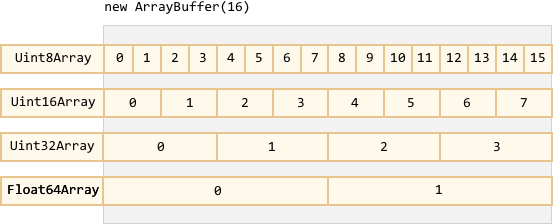

# ArrayBuffer and views

Binary data appears when we work with arbitrary files (uploading, downloading, creation). Or when we want to do image/audio processing.

That's all possible in Javascript, and binary operations are high-performant.

Although, there's a bit of confusion, because there are many classes. To name a few:
- `ArrayBuffer`, `Uint8Array`, `DataView`, etc.

It may seem complex, but in fact it's not. Everything's fairly simple.

Let's sort things out.

**The basic binary object is `ArrayBuffer` -- a fixed-length raw sequence of bytes.**

We create it like this:
```js run
let buffer = new ArrayBuffer(16); // create a buffer of length 16
alert(buffer.byteLength); // 16
```

This allocates a contiguous memory area of 16 bytes and pre-fills it with zeroes.

```warn header="`ArrayBuffer` is not `Array` at all"
`ArrayBuffer` has nothing in common with `Array`:
- It has a fixed length, we can't increase or decrease it.
- It takes exactly that much space in the memory.
- It can't store any value: only bytes, the exact number of them.
```

`ArrayBuffer` is a raw sequence of bytes. What's stored in it? It has no clue.

**To manipulate an `ArrayBuffer`, we need to use a "view" object.**

A view object does not store anything on it's own. It's just an "eyeglasses" that gives an interpretation of the bytes stored in the `ArrayBuffer`.

For instance:

- **`Uint8Array`** -- treats each byte as a separate number, with possible values are from 0 to 255 (a byte is 8-bit, so can hold only that much). That's called a "8-bit unsigned integer".
- **`Uint16Array`** -- treats every 2 bytes as an integer, with possible values from 0 to 65535. That's called a "16-bit unsigned integer".
- **`Uint32Array`** -- treats every 4 bytes as an integer, with possible values from 0 to 4294967295. That's called a "32-bit unsigned integer".
- **`Float64Array`** -- treats every 8 bytes as a floating point number with possible values from <code>5.0x10<sup>-324</sup></code> to <code>1.8x10<sup>308</sup></code>.

So, the binary data in an `ArrayBuffer` of 16 bytes can be interpreted as 16 "tiny numbers", or 8 bigger numbers, or 4 even bigger, or 2 floating-point values with high precision.



`ArrayBuffer` is the core object, the root of everything, the raw binary data. But if we're going to write into it, or iterate over it, basically for almost any operation – we must use a view, e.g:

```js run
let buffer = new ArrayBuffer(16); // create a buffer of length 16

*!*
let view = new Uint32Array(buffer); // treat every 4 bytes as an integer number
*/!*

alert(view.length); // 4, it stores that many numbers
alert(view.byteLength); // 16, the length in bytes

// let's write a value
view[0] = 123456;

// iterate over bytes
for(let num of view) {
  alert(num); // 123456, then 0, 0, 0 (4 numbers total)
}

alert(Uint32Array.BYTES_PER_ELEMENT); // 4 (that many bytes per number)
```

The common term for all these views is [TypedArray](https://tc39.github.io/ecma262/#sec-typedarray-objects). They share the same set of methods and properities.

They are much more like regular arrays: have indexes and iterable.

## TypedArray

A typed array constructor (be it `Int8Array` or `Float64Array`, doesn't matter) behaves differently depending on argument types.

There are 5 variants:

```js
new TypedArray(buffer, [byteOffset], [length]);
new TypedArray(object);
new TypedArray(typedArray);
new TypedArray(length);
new TypedArray();
```

A view cannot exist without an underlying `ArrayBuffer`, so gets created automatically in all these calls except the first one.

1. If an `ArrayBuffer` argument is supplied, the view is created over it. We used that syntax already.

    Optionally we can provide `byteOffset` to start from (0 by default) and the `length` (till the end of the buffer by default).

2. If an `Array`, or any array-like object is given, it behaves as `Array.from`: creates a typed array of the same length and copies the content.

    We can use it to pre-fill the array with the data:
    ```js run
    *!*
    let arr = new Uint8Array([0, 1, 2, 3]);
    */!*
    alert( arr.length ); // 4
    alert( arr[1] ); // 1
    ```
3. If another `TypedArray` is supplied, it's contents is also copied. Values are converted to the new type in the process. The new array will have the same length.
    ```js run
    let arr16 = new Uint16Array([1, 1000]);
    *!*
    let arr8 = new Uint8Array(arr16);
    */!*
    alert( arr8[0] ); // 1
    alert( arr8[1] ); // 232 (tried to copy 1000, but can't fit 1000 into 8 bits)
    ```

4. For a numeric argument `length` -- creates an `ArrayBuffer` to contain that many elements. Its byte length will be `length` multiplied by the number of bytes in a single item `TypedArray.BYTES_PER_ELEMENT`:
    ```js run
    let arr = new Uint16Array(4);
    alert( Uint16Array.BYTES_PER_ELEMENT ); // 2 bytes per number
    alert( arr.byteLength ); // 8 bytes in the buffer, to contain four 2-byte numbers
    ```

5. Without arguments, creates an zero-length empty `ArrayBuffer`.

Here's the full list of typed arrays:

- `Uint8Array`, `Uint16Array`, `Uint32Array` -- for integer numbers of 8, 16 and 32 bits.
  - `Uint8ClampedArray` -- for 8-bit integers, "clamps" them on assignment (see below).
- `Int8Array`, `Int16Array`, `Int32Array` -- for signed integer numbers (can be negative).
- `Float32Array`, `Float64Array` -- for signed floating-point numbers of 32 and 64 bits.

```warn header="No `int8` or similar single-valued types"
Please note, despite of the names like `Int8Array`, there's no type like `int8`, or similar in Javascript.

That's logical, as `Int8Array` is technically not an array, but rather a view on `ArrayBuffer`.
```

### Out-of-bounds behavior

What if we attempt to write an out-of-bounds value into a typed array? There will be no error. But the result may be not what we want.

For instance, let's try to put 256 into `Uint8Array`. In binary form, 256 is `100000000` (9 bits), but `Uint8Array` only provides 8 bits per value, that makes the available range from 0 to 255.

For bigger numbers, only the rightmost (less significant) 8 bits are stored, and the rest is cut off:


So we'll get zero.

For 257, the binary form is `100000001` (9 bits), the rightmost 8 get stored, so we'll have `1` in the array:


In other words, the number modulo 2<sup>8</sup> is saved.

Here's the demo:

```js run
let buffer = new ArrayBuffer(16);
let uint8array = new Uint8Array(buffer);

let num = 256;
alert(num.toString(2)); // 100000000 (binary representation)

uint8array[0] = 256;
uint8array[1] = 257;

alert(uint8array[0]); // 0
alert(uint8array[1]); // 1
```

`Uint8ClampedArray` is special in this aspect, its behavior is different. It saves 255 for any number that is greater than 255, and 0 for any negative number. That behavior is sometimes useful for image processing.

## TypedArray methods

`TypedArray` has regular `Array` methods, with notable exceptions.

We can iterate, `map`, `slice`, `find`, `reduce` etc.

There are few things we can't do though:

- No `splice` -- we can't "delete" a value, because typed arrays are views on a buffer, and these are fixed, contiguous areas of memory. All we can do is to assign a zero.
- No `concat` method.

There are two additional properties:

- `arr.buffer` -- the reference to the underlying `ArrayBuffer`.
- `arr.byteLength` -- the byte size of the underlying `ArrayBuffer`.

...And methods:

- `arr.set(fromArr, [offset])` copies all elements from `fromArr` to the `arr`, starting at position `offset` (0 by default).
- `arr.subarray([begin, end])` creates a new view of the same type from `begin` to `end` (exclusive). That's similar to `arr.slice` method, but doesn't copy anything -- just creates a new view.

These methods allow us to copy typed arrays one onto another, create new arrays from existing ones.


## DataView

[DataView](https://developer.mozilla.org/en-US/docs/Web/JavaScript/Reference/Global_Objects/DataView) is a special super-flexible "untyped" view over `ArrayBuffer`.

It allows to access the data on any offset in any format.

- For typed arrays, the constructor dictates what the format is, then we access i-th number as `arr[i]`. All array members are assumed to have the same format.
- With `DataView` we access the data with methods like `.getUint8(i)`. So we decide what the format is at method call time instead of the construction time.

The syntax:

```js
new DataView(buffer, [byteOffset], [byteLength])
```

- **`buffer`** -- the underlying `ArrayBuffer`. Unlike typed arrays, `DataView` doesn't create a buffer on its own. We need to have it ready.
- **`byteOffset`** -- the starting byte position of the view (by default 0).
- **`byteLength`** -- the byte length of the view (by default till the end of `buffer`).

For instance, here we extract numbers in different formats from the same buffer:

```js run
let buffer = new Uint8Array([255, 255, 255, 255]).buffer;

let dataView = new DataView(buffer);

// get 8-bit number at offset 0
alert( dataView.getUint8(0) ); // 255

// now get 16-bit number at offset 0, that's 2 bytes, both with max value
alert( dataView.getUint16(0) ); // 65535 (biggest 16-bit unsigned int)

// get 32-bit number at offset 0
alert( dataView.getUint32(0) ); // 4294967295 (biggest 32-bit unsigned int)

dataView.setUint32(0, 0); // set 4-byte number to zero
```

`DataView` is great when we store mixed-format data in the same buffer. E.g 8-bit integers followed by 32-bit floats, or more complex.

## Summary

`ArrayBuffer` is the core object, a raw byte sequence.

To do almost any operation on `ArrayBuffer`, we need a view.

- It can be a `TypedArray`:
    - `Uint8Array`, `Uint16Array`, `Uint32Array` -- for integer numbers of 8, 16 and 32 bits.
    - `Uint8ClampedArray` -- for 8-bit integers, "clamps" them on assignment.
    - `Int8Array`, `Int16Array`, `Int32Array` -- for signed integer numbers (can be negative).
    - `Float32Array`, `Float64Array` -- for signed floating-point numbers of 32 and 64 bits.
- Or a `DataView` -- the view that uses methods to specify a format, e.g. `getUint8(offset)`.

In most cases we create and operate directly on typed arrays, leaving `ArrayBuffer` under cover, as a "common discriminator". We can access it as `.buffer` and make another view if needed.

There are also two additional terms:
- `ArrayBufferView` is an umbrella term for all these kinds of views.
- `BufferSource` is an umbrella term for `ArrayBuffer` or `ArrayBufferView`.

These are used in descriptions of methods that operate on binary data. `BufferSource` is one of the most common words, as it means "`ArrayBuffer` or a view over it"

Here's a cheatsheet:


