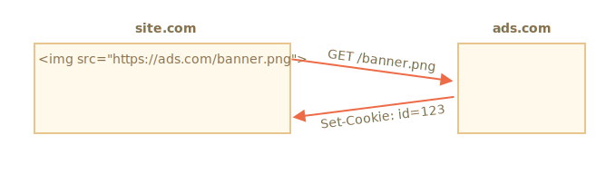
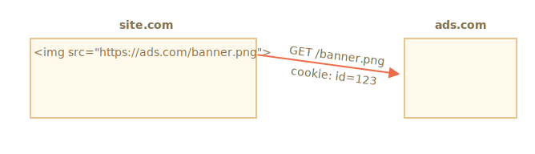
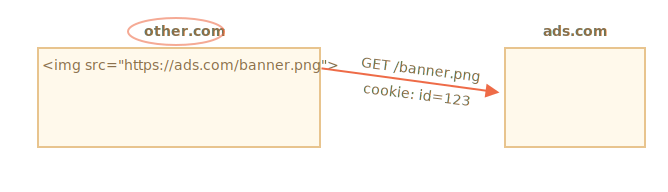

# Cookies, document.cookie

Cookies are small strings of data that are stored directly in the browser. They are a part of the HTTP protocol, defined by the [RFC 6265](https://tools.ietf.org/html/rfc6265) specification.

Cookies are usually set by a web server using the response `Set-Cookie` HTTP header. Then, the browser automatically adds them to (almost) every request to the same domain using the `Cookie` HTTP header.

One of the most widespread use cases is authentication:

1. Upon sign-in, the server uses the `Set-Cookie` HTTP header in the response to set a cookie with a unique "session identifier".
2. Next time the request is sent to the same domain, the browser sends the cookie over the net using the `Cookie` HTTP header.
3. So the server knows who made the request.

We can also access cookies from the browser, using `document.cookie` property.

There are many tricky things about cookies and their attributes. In this chapter, we'll cover them in detail.

## Reading from document.cookie

```online
Does your browser store any cookies from this site? Let's see:
```

```offline
Assuming you're on a website, it's possible to see the cookies from it, like this:
```

```js run
// At javascript.info, we use Google Analytics for statistics,
// so there should be some cookies
alert( document.cookie ); // cookie1=value1; cookie2=value2;...
```


The value of `document.cookie` consists of `name=value` pairs, delimited by `; `. Each one is a separate cookie.

To find a particular cookie, we can split `document.cookie` by `; `, and then find the right name. We can use either a regular expression or array functions to do that.

We leave it as an exercise for the reader. Also, at the end of the chapter, you'll find helper functions to manipulate cookies.

## Writing to document.cookie

We can write to `document.cookie`. But it's not a data property, it's an [accessor (getter/setter)](info:property-accessors). An assignment to it is treated specially.

**A write operation to `document.cookie` updates only the cookie mentioned in it and doesn't touch other cookies.**

For instance, this call sets a cookie with the name `user` and value `John`:

```js run
document.cookie = "user=John"; // update only cookie named 'user'
alert(document.cookie); // show all cookies
```

If you run it, you will likely see multiple cookies. That's because the `document.cookie=` operation does not overwrite all cookies. It only sets the mentioned cookie `user`.

Technically, name and value can have any characters. To keep the valid formatting, they should be escaped using a built-in `encodeURIComponent` function:

```js run
// special characters (spaces) need encoding
let name = "my name";
let value = "John Smith"

// encodes the cookie as my%20name=John%20Smith
document.cookie = encodeURIComponent(name) + '=' + encodeURIComponent(value);

alert(document.cookie); // ...; my%20name=John%20Smith
```


```warn header="Limitations"
There are a few limitations:
- You can only set/update a single cookie at a time using `document.cookie`.
- The `name=value` pair, after `encodeURIComponent`, should not exceed 4KB. So we can't store anything huge in a cookie.
- The total number of cookies per domain is limited to around 20+, the exact limit depends on the browser.
```

Cookies have several attributes, many of which are important and should be set.

The attributes are listed after `key=value`, delimited by `;`, like this:

```js run
document.cookie = "user=John; path=/; expires=Tue, 19 Jan 2038 03:14:07 GMT"
```

## domain

- **`domain=site.com`**

A domain defines where the cookie is accessible. In practice though, there are limitations. We can't set any domain.

**There's no way to let a cookie be accessible from another 2nd-level domain, so `other.com` will never receive a cookie set at `site.com`.**

It's a safety restriction, to allow us to store sensitive data in cookies that should be available only on one site.

By default, a cookie is accessible only at the domain that set it.

Please note, by default, a cookie is not shared with a subdomain, such as `forum.site.com`.

```js
// if we set a cookie at site.com website...
document.cookie = "user=John"

// ...we won't see it at forum.site.com
alert(document.cookie); // no user
```

...But this can be changed. If we'd like to allow subdomains like `forum.site.com` to get a cookie set at `site.com`, that's possible.

For that to happen, when setting a cookie at `site.com`, we should explicitly set the `domain` attribute to the root domain: `domain=site.com`. Then all subdomains will see such a cookie.

For example:

```js
// at site.com
// make the cookie accessible on any subdomain *.site.com:
document.cookie = "user=John; *!*domain=site.com*/!*"

// later

// at forum.site.com
alert(document.cookie); // has cookie user=John
```

```warn header="Legacy syntax"
Historically, `domain=.site.com` (with a dot before `site.com`) used to work the same way, allowing access to the cookie from subdomains. Leading dots in domain names are now ignored, but some browsers may decline to set the cookie containing such dots.
```

To summarize, the `domain` attribute allows to make a cookie accessible at subdomains.

## path

- **`path=/mypath`**

The URL path prefix must be absolute. It makes the cookie accessible for pages under that path. By default, it's the current path.

If a cookie is set with `path=/admin`, it's visible on pages `/admin` and `/admin/something`, but not at `/home`, `/home/admin` or `/`.

Usually, we should set `path` to the root: `path=/` to make the cookie accessible from all website pages. If this attribute is not set the default is calculated using [this method](https://developer.mozilla.org/en-US/docs/Web/HTTP/Cookies#path_default_value).

## expires, max-age

By default, if a cookie doesn't have one of these attributes, it disappears when the browser/tab is closed. Such cookies are called "session cookies"

To let cookies survive a browser close, we can set either the `expires` or `max-age` attribute. `max-Age` has precedence if both are set.

- **`expires=Tue, 19 Jan 2038 03:14:07 GMT`**

The cookie expiration date defines the time when the browser will automatically delete it (according to the browser's time zone).

The date must be exactly in this format, in the GMT timezone. We can use `date.toUTCString` to get it. For instance, we can set the cookie to expire in 1 day:

```js
// +1 day from now
let date = new Date(Date.now() + 86400e3);
date = date.toUTCString();
document.cookie = "user=John; expires=" + date;
```

If we set `expires` to a date in the past, the cookie is deleted.

-  **`max-age=3600`**

It's an alternative to `expires` and specifies the cookie's expiration in seconds from the current moment.

If set to zero or a negative value, the cookie is deleted:

```js
// cookie will die in +1 hour from now
document.cookie = "user=John; max-age=3600";

// delete cookie (let it expire right now)
document.cookie = "user=John; max-age=0";
```

## secure

- **`secure`**

The cookie should be transferred only over HTTPS.

**By default, if we set a cookie at `http://site.com`, then it also appears at `https://site.com` and vice versa.**

That is, cookies are domain-based, they do not distinguish between the protocols.

With this attribute, if a cookie is set by `https://site.com`, then it doesn't appear when the same site is accessed by HTTP, as `http://site.com`. So if a cookie has sensitive content that should never be sent over unencrypted HTTP, the `secure` flag is the right thing.

```js
// assuming we're on https:// now
// set the cookie to be secure (only accessible over HTTPS)
document.cookie = "user=John; secure";
```

## samesite

This is another security attribute `samesite`. It's designed to protect from so-called XSRF (cross-site request forgery) attacks.

To understand how it works and when it's useful, let's take a look at XSRF attacks.

### XSRF attack

Imagine, you are logged into the site `bank.com`. That is: you have an authentication cookie from that site. Your browser sends it to `bank.com` with every request so that it recognizes you and performs all sensitive financial operations.

Now, while browsing the web in another window, you accidentally come to another site `evil.com`. That site has JavaScript code that submits a form `<form action="https://bank.com/pay">` to `bank.com` with fields that initiate a transaction to the hacker's account.

The browser sends cookies every time you visit the site `bank.com`, even if the form was submitted from `evil.com`. So the bank recognizes you and performs the payment.


This is a so-called "Cross-Site Request Forgery" (in short, XSRF) attack.

Real banks are protected from it of course. All forms generated by `bank.com` have a special field, a so-called "XSRF protection token", that an evil page can't generate or extract from a remote page. It can submit a form there, but can't get the data back. The site `bank.com` checks for such a token in every form it receives.

Such a protection takes time to implement though. We need to ensure that every form has the required token field, and we must also check all requests.

### Use cookie samesite attribute

The cookie `samesite` attribute provides another way to protect from such attacks, that (in theory) should not require "xsrf protection tokens".

It has two possible values:

- **`samesite=strict`**

A cookie with `samesite=strict` is never sent if the user comes from outside the same site.

In other words, whether a user follows a link from their email, submits a form from `evil.com`, or does any operation that originates from another domain, the cookie is not sent.

If authentication cookies have the `samesite=strict` attribute, then an XSRF attack has no chance of succeeding, because a submission from `evil.com` comes without cookies. So `bank.com` will not recognize the user and will not proceed with the payment.

The protection is quite reliable. Only operations that come from `bank.com` will send the `samesite=strict` cookie, e.g. a form submission from another page at `bank.com`.

Although, there's a small inconvenience.

When a user follows a legitimate link to `bank.com`, like from their notes, they'll be surprised that `bank.com` does not recognize them. Indeed, `samesite=strict` cookies are not sent in that case.

We could work around that by using two cookies: one for "general recognition", only to say: "Hello, John", and the other one for data-changing operations with `samesite=strict`. Then, a person coming from outside of the site will see a welcome, but payments must be initiated from the bank's website, for the second cookie to be sent.

- **`samesite=lax` (same as `samesite` without value)**

A more relaxed approach that also protects from XSRF and doesn't break the user experience.

Lax mode, just like `strict`, forbids the browser to send cookies when coming from outside the site, but adds an exception.

A `samesite=lax` cookie is sent if both of these conditions are true:
1. The HTTP method is "safe" (e.g. GET, but not POST).

    The full list of safe HTTP methods is in the [RFC7231 specification](https://tools.ietf.org/html/rfc7231#section-4.2.1). These are the methods that should be used for reading, but not writing the data. They must not perform any data-changing operations. Following a link is always GET, the safe method.

2. The operation performs a top-level navigation (changes URL in the browser address bar).

    This is usually true, but if the navigation is performed in an `<iframe>`, then it is not top-level. Additionally, JavaScript methods for network requests do not perform any navigation.

So, what `samesite=lax` does, is to allow the most common "go to URL" operation to have cookies. E.g. opening a website link from notes that satisfy these conditions.

But anything more complicated, like a network request from another site or a form submission, loses cookies.

If that's fine for you, then adding `samesite=lax` will probably not break the user experience and add protection.

Overall, `samesite` is a great attribute.

There's a drawback:

- `samesite` is ignored (not supported) by very old browsers, the year 2017 or so.

**So if we solely rely on `samesite` to provide protection, then old browsers will be vulnerable.**

But we can use `samesite` together with other protection measures, like xsrf tokens, to add a layer of defence and then, in the future, when old browsers die out, we'll probably be able to drop xsrf tokens.

## httpOnly

This attribute has nothing to do with JavaScript, but we have to mention it for completeness.

The web server uses the `Set-Cookie` header to set a cookie. Also, it may set the `httpOnly` attribute.

This attribute forbids any JavaScript access to the cookie. We can't see such a cookie or manipulate it using `document.cookie`.

This is used as a precautionary measure, to protect from certain attacks when a hacker injects his own JavaScript code into a page and waits for a user to visit that page. That shouldn't be possible at all, hackers should not be able to inject their code into our site, but there may be bugs that let them do it.


Normally, if such a thing happens, and a user visits a web-page with a hacker's JavaScript code, then that code executes and gains access to `document.cookie` with user cookies containing authentication information. That's bad.

But if a cookie is `httpOnly`, then `document.cookie` doesn't see it, so it is protected.

## Appendix: Cookie functions

Here's a small set of functions to work with cookies, more convenient than a manual modification of `document.cookie`.

There exist many cookie libraries for that, so these are for demo purposes. Fully working though.

### getCookie(name)

The shortest way to access a cookie is to use a [regular expression](info:regular-expressions).

The function `getCookie(name)` returns the cookie with the given `name`:

```js
// returns the cookie with the given name,
// or undefined if not found
function getCookie(name) {
  let matches = document.cookie.match(new RegExp(
    "(?:^|; )" + name.replace(/([\.$?*|{}\(\)\[\]\\\/\+^])/g, '\\$1') + "=([^;]*)"
  ));
  return matches ? decodeURIComponent(matches[1]) : undefined;
}
```

Here `new RegExp` is generated dynamically, to match `; name=<value>`.

Please note that a cookie value is encoded, so `getCookie` uses a built-in `decodeURIComponent` function to decode it.

### setCookie(name, value, attributes)

Sets the cookie's `name` to the given `value` with `path=/` by default (can be modified to add other defaults):

```js run
function setCookie(name, value, attributes = {}) {

  attributes = {
    path: '/',
    // add other defaults here if necessary
    ...attributes
  };

  if (attributes.expires instanceof Date) {
    attributes.expires = attributes.expires.toUTCString();
  }

  let updatedCookie = encodeURIComponent(name) + "=" + encodeURIComponent(value);

  for (let attributeKey in attributes) {
    updatedCookie += "; " + attributeKey;
    let attributeValue = attributes[attributeKey];
    if (attributeValue !== true) {
      updatedCookie += "=" + attributeValue;
    }
  }

  document.cookie = updatedCookie;
}

// Example of use:
setCookie('user', 'John', {secure: true, 'max-age': 3600});
```

### deleteCookie(name)

To delete a cookie, we can call it with a negative expiration date:

```js
function deleteCookie(name) {
  setCookie(name, "", {
    'max-age': -1
  })
}
```

```warn header="Updating or deleting must use same path and domain"
Please note: when we update or delete a cookie, we should use exactly the same path and domain attributes as when we set it.
```

Together: [cookie.js](cookie.js).


## Appendix: Third-party cookies

A cookie is called "third-party" if it's placed by a domain other than the page the user is visiting.

For instance:
1. A page at `site.com` loads a banner from another site: ``.
2. Along with the banner, the remote server at `ads.com` may set the `Set-Cookie` header with a cookie like `id=1234`. Such a cookie originates from the `ads.com` domain, and will only be visible at `ads.com`:

    

3. Next time when `ads.com` is accessed, the remote server gets the `id` cookie and recognizes the user:

    

4. What's even more important is, when the user moves from `site.com` to another site `other.com`, which also has a banner, then `ads.com` gets the cookie, as it belongs to `ads.com`, thus recognizing the visitor and tracking him as he moves between sites:

    


Third-party cookies are traditionally used for tracking and ads services, due to their nature. They are bound to the originating domain, so `ads.com` can track the same user between different sites, if they all access it.

Naturally, some people don't like being tracked, so browsers allow them to disable such cookies.

Also, some modern browsers employ special policies for such cookies:
- Safari does not allow third-party cookies at all.
- Firefox comes with a "black list" of third-party domains where it blocks third-party cookies.


```smart
If we load a script from a third-party domain, like `<script src="https://google-analytics.com/analytics.js">`, and that script uses `document.cookie` to set a cookie, then such cookie is not third-party.

If a script sets a cookie, then no matter where the script came from -- the cookie belongs to the domain of the current webpage.
```

## Appendix: GDPR

This topic is not related to JavaScript at all, it is just something to keep in mind when setting cookies.

There's a legislation in Europe called GDPR, that enforces a set of rules for websites to respect the users' privacy. One of these rules is to require explicit permission for tracking cookies from the user.

Please note, that's only about tracking/identifying/authorizing cookies.

So, if we set a cookie that just saves some information, but neither tracks nor identifies the user, then we are free to do it.

But if we are going to set a cookie with an authentication session or a tracking ID, then a user must allow that.

Websites generally have two variants of complying with GDPR. You are likely to have seen them both on the web:

1. If a website wants to set tracking cookies only for authenticated users.

    To do so, the registration form should have a checkbox like "accept the privacy policy" (that describes how cookies are used), the user must check it, and then the website is free to set auth cookies.

2. If a website wants to set tracking cookies for everyone.

    To do so legally, a website shows a modal "splash screen" for newcomers and requires them to agree to the cookies. Then the website can set them and let people see the content. That can be disturbing for new visitors though. No one likes to see such "must-click" modal splash screens instead of the content. But GDPR requires an explicit agreement.


GDPR is not only about cookies, it is about other privacy-related issues too, but that is beyond our scope.


## Summary

`document.cookie` provides access to cookies.
- Write operations modify only the cookie mentioned in it.
- Name/value must be encoded.
- One cookie may not exceed 4KB in size. The number of cookies allowed on a domain is around 20+ (varies by browser).

Cookie attributes:
- `path=/`, by default current path, makes the cookie visible only under that path.
- `domain=site.com`, by default a cookie is visible on the current domain only. If the domain is set explicitly, the cookie becomes visible on subdomains.
- `expires` or `max-age` sets the cookie expiration time. Without them, the cookie dies when the browser is closed.
- `secure` makes the cookie HTTPS-only.
- `samesite` forbids the browser to send the cookie with requests coming from outside the site. This helps to prevent XSRF attacks.

Additionally:
- The browser may forbid third-party cookies, e.g. Safari does that by default. There is also work in progress to implement this in Chrome.
- When setting a tracking cookie for EU citizens, GDPR requires to ask for permission.
