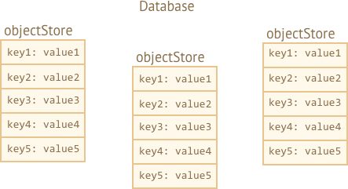
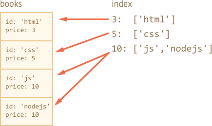

libs:
  - 'https://cdn.jsdelivr.net/npm/idb@3.0.2/build/idb.min.js'

---

# IndexedDB

IndexedDB is a built-in database, much more powerful than `localStorage`.

- Key/value storage: value can be (almost) anything, multiple key types.
- Supports transactions for reliability.
- Supports key range queries, indexes.
- Can store much more data than `localStorage`.

That power is usually excessive for traditional client-server apps. IndexedDB is intended for offline apps, to be combined with ServiceWorkers and other technologies.

The native interface to IndexedDB, described in the specification <https://www.w3.org/TR/IndexedDB>, is event-based.

We can also use `async/await` with the help of a promise-based wrapper, like <https://github.com/jakearchibald/idb>. That's pretty convenient, but the wrapper is not perfect, it can't replace events for all cases. So we'll start with events, and  then, after we gain understanding of IndexedDb, we'll use the wrapper.

## Open database

To start working with IndexedDB, we first need to open a database.

The syntax:

```js
let openRequest = indexedDB.open(name, version);
```

- `name` -- a string, the database name.
- `version` -- a positive integer version, by default `1` (explained below).

We can have many databases with different names, but all of them exist within the current origin (domain/protocol/port). Different websites can't access databases of each other.

After the call, we need to listen to events on `openRequest` object:
- `success`: database is ready, there's the "database object" in `openRequest.result`, that we should use it for further calls.
- `error`: opening failed.
- `upgradeneeded`: database is ready, but its version is outdated (see below).

**IndexedDB has a built-in mechanism of "schema versioning", absent in server-side databases.**

Unlike server-side databases, IndexedDB is client-side, the data is stored in the browser, so we, developers, don't have direct access to it. But when we publish a new version of our app, we may need to update the database.

If the local database version is less than specified in `open`, then a special event `upgradeneeded` is triggered, and we can compare versions and upgrade data structures as needed.

The event also triggers when the database did not exist yet, so we can perform initialization.

When we first publish our app, we open it with version `1` and perform the initialization in `upgradeneeded` handler:

```js
let openRequest = indexedDB.open("store", *!*1*/!*);

openRequest.onupgradeneeded = function() {
  // triggers if the client had no database
  // ...perform initialization...
};

openRequest.onerror = function() {
  console.error("Error", openRequest.error);
};

openRequest.onsuccess = function() {
  let db = openRequest.result;
  // continue to work with database using db object
};
```

When we publish the 2nd version:

```js
let openRequest = indexedDB.open("store", *!*2*/!*);

openRequest.onupgradeneeded = function() {
  // the existing database version is less than 2 (or it doesn't exist)
  let db = openRequest.result;
  switch(db.version) { // existing db version
    case 0:
      // version 0 means that the client had no database
      // perform initialization
    case 1:
      // client had version 1
      // update
  }
};
```

So, in `openRequest.onupgradeneeded` we update the database. Soon we'll see how it's done. And then, only if its handler finishes without errors, `openRequest.onsuccess` triggers.

After `openRequest.onsuccess` we have the database object in `openRequest.result`, that we'll use for further operations.

To delete a database:

```js
let deleteRequest = indexedDB.deleteDatabase(name)
// deleteRequest.onsuccess/onerror tracks the result
```

### Opening an old version

Now what if we try to open a database with a lower version than the current one?
E.g. the existing DB version is 3, and we try to `open(...2)`. That's simple:  `openRequest.onerror` triggers.

Such thing may happen if the visitor loaded an outdated code, e.g. from a proxy cache. We should check `db.version`, suggest him to reload the page, and also make sure that our caching policy is correct.

### Multi-page update problem

As we're talking about versioning, let's tackle a small related problem.

Let's say, a visitor opened our site in a browser tab, with database version 1.

Then we rolled out an update, and the same visitor opens our site in another tab. So there are two tabs, both with our site, but one has an open connection with DB version 1, while the other one attempts to update it in `upgradeneeded` handler.

The problem is that a database is shared between two tabs, as that's the same site, same origin. And it can't be both version 1 and 2. To perform the update to version 2, all connections to version 1 must be closed.

In order to organize that, there's `versionchange` event on an open database object. We should listen to it, as it lets us know that the version is about to change, so that we should close the database (and probably suggest the visitor to reload the page, to load the updated code).

If we don't close it, then the second connection will be blocked with `blocked` event instead of `success`.

Here's the code to work around it, it has two minor additions:

```js
let openRequest = indexedDB.open("store", 2);

openRequest.onupgradeneeded = ...;
openRequest.onerror = ...;

openRequest.onsuccess = function() {
  let db = openRequest.result;

  *!*
  db.onversionchange = function() {
    db.close();
    alert("Your database is outdated, please reload the page.")
  };
  */!*

  // ...the db is ready, use it...
};

*!*
openRequest.onblocked = function() {
  // there's another open connection to same database
  // and it wasn't closed after db.onversionchange triggered for them
};
*/!*
```

We do two things:

1. Add `db.onversionchange` listener after a successful opening, to close the old database.
2. Add `openRequest.onblocked` listener to handle the case when an old connection wasn't closed. This doesn't happen if we close it in `db.onversionchange`.

Alternatively, we can take time to close things gracefully in `db.onversionchange`, prompt the visitor to do something. The new connection will be blocked immediatelly after `db.onversionchange` finished without closing, but we can try to reopen it later.

That's up to us, how we handle such version collision, it happens rarely, but we should at least have some handling for it, e.g. `onblocked` handler, so that our script doesn't just die silently.

## Object store

To store stomething in IndexedDB, we need an *object store*.

An object store is a core concept of IndexedDB. Counterparts in other databases are called "tables" or "collections". It's where the data is stored. A database may have multiple stores: one for users, another one for goods, etc.

Despite being named an "object store", primitives can be stored too.

**We can store almost any value, including complex objects.**

IndexedDB uses the [standard serialization algorithm](https://www.w3.org/TR/html53/infrastructure.html#section-structuredserializeforstorage) to clone-and-store an object. It's like `JSON.stringify`, but more powerful, capable of storing much more datatypes.

An example of object that can't be stored: an object with circular references. Such objects are not serializable. `JSON.stringify` also fails for such objects.

**There must be a unique `key` for every value in the store.**     

A key must have a type one of: number, date, string, binary, or array. It's an unique identifier: we can search/remove/update values by the key.




As we'll see very soon, we can provide a key when we add a value to the store, similar to `localStorage`. But when we store objects, IndexedDB allows to setup an object property as the key, that's much more convenient. Or we can auto-generate keys.

But we need to create an object store first.


The syntax to create an object store:
```js
db.createObjectStore(name[, keyOptions]);
```

Please note, the operation is synchronous, no `await` needed.

- `name` is the store name, e.g. `"books"` for books,
- `keyOptions` is an optional object with one of two properties:
  - `keyPath` -- a path to an object property that IndexedDB will use as the key, e.g. `id`.
  - `autoIncrement` -- if `true`, then the key for a newly stored object is generated automatically, as an ever-incrementing number.

If we don't supply `keyOptions`, then we'll need to provide a key explicitly later, when storing an object.

For instance, this object store uses `id` property as the key:
```js
db.createObjectStore('books', {keyPath: 'id'});
```

**An object store can only be created/modified while updating the DB version, in `upgradeneeded` handler.**

That's a technical limitation. Outside of the handler we'll be able to add/remove/update the data, but object stores can be created/removed/altered only during version update.

To perform database version upgrade, there are two main approaches:
1. We can implement per-version upgrade functions: from 1 to 2, from 2 to 3, from 3 to 4 etc. Then, in `upgradeneeded` we can compare versions (e.g. old 2, now 4) and run per-version upgrades step by step, for every intermediate version (2 to 3, then 3 to 4).
2. Or we can just examine the database: get a list of existing object stores as `db.objectStoreNames`. That object is a [DOMStringList](https://html.spec.whatwg.org/multipage/common-dom-interfaces.html#domstringlist) that provides `contains(name)` method to check for existance. And then we can do updates depending on what exists and what doesn't.

For small databases the second variant may be simpler.

Here's the demo of the second approach:

```js
let openRequest = indexedDB.open("db", 2);

// create/upgrade the database without version checks
openRequest.onupgradeneeded = function() {
  let db = openRequest.result;
  if (!db.objectStoreNames.contains('books')) { // if there's no "books" store
    db.createObjectStore('books', {keyPath: 'id'}); // create it
  }
};
```


To delete an object store:

```js
db.deleteObjectStore('books')
```

## Transactions

The term "transaction" is generic, used in many kinds of databases.

A transaction is a group operations, that should either all succeed or all fail.

For instance, when a person buys something, we need:
1. Subtract the money from their account.
2. Add the item to their inventory.

It would be pretty bad if we complete the 1st operation, and then something goes wrong, e.g. lights out, and we fail to do the 2nd. Both should either succeed (purchase complete, good!) or both fail (at least the person kept their money, so they can retry).

Transactions can guarantee that.

**All data operations must be made within a transaction in IndexedDB.**

To start a transaction:

```js run
db.transaction(store[, type]);
```

- `store` is a store name that the transaction is going to access, e.g. `"books"`. Can be an array of store names if we're going to access multiple stores.
- `type` – a transaction type, one of:
  - `readonly` -- can only read, the default.
  - `readwrite` -- can only read and write the data, but not create/remove/alter object stores.

There's also `versionchange` transaction type: such transactions can do everything, but we can't create them manually. IndexedDB automatically creates a `versionchange` transaction when opening the database, for `updateneeded` handler. That's why it's a single place where we can update the database structure, create/remove object stores.

```smart header="Why there exist different types of transactions?"
Performance is the reason why transactions need to be labeled either `readonly` and `readwrite`.

Many `readonly` transactions are able to access concurrently the same store, but `readwrite` transactions can't. A `readwrite` transaction "locks" the store for writing. The next transaction must wait before the previous one finishes before accessing the same store.
```

After the transaction is created, we can add an item to the store, like this:

```js
let transaction = db.transaction("books", "readwrite"); // (1)

// get an object store to operate on it
*!*
let books = transaction.objectStore("books"); // (2)
*/!*

let book = {
  id: 'js',
  price: 10,
  created: new Date()
};

*!*
let request = books.add(book); // (3)
*/!*

request.onsuccess = function() { // (4)
  console.log("Book added to the store", request.result);
};

request.onerror = function() {
  console.log("Error", request.error);
};
```

There were basically four steps:

1. Create a transaction, mention all stores it's going to access, at `(1)`.
2. Get the store object using `transaction.objectStore(name)`, at `(2)`.
3. Perform the request to the object store `books.add(book)`, at `(3)`.
4. ...Handle request success/error `(4)`, then we can make other requests if needed, etc.

Object stores support two methods to store a value:

- **put(value, [key])**
    Add the `value` to the store. The `key` is supplied only if the object store did not have `keyPath` or `autoIncrement` option. If there's already a value with same key, it will be replaced.

- **add(value, [key])**
    Same as `put`, but if there's already a value with the same key, then the request fails, and an error with the name `"ConstraintError"` is generated.

Similar to opening a database, we can send a request: `books.add(book)`, and then wait for `success/error` events.

- The `request.result` for `add` is the key of the new object.
- The error is in `request.error` (if any).

## Transactions' autocommit

In the example above we started the transaction and made `add` request. But as we stated previously, a transaction may have multiple associated requests, that must either all success or all fail. How do we mark the transaction as finished, no more requests to come?

The short answer is: we don't.

In the next version 3.0 of the specification, there will probably be a manual way to finish the transaction, but right now in 2.0 there isn't.

**When all transaction requests are finished, and the [microtasks queue](info:microtask-queue) is empty, it is committed automatically.**

Usually, we can assume that a transaction commits when all its requests are complete, and the current code finishes.

So, in the example above no special call is needed to finish the transaction.

Transactions auto-commit principle has an important side effect. We can't insert an async operation like `fetch`, `setTimeout` in the middle of transaction. IndexedDB will not keep the transaction waiting till these are done.

In the code below `request2` in line `(*)` fails, because the transaction is already committed, can't make any request in it:

```js
let request1 = books.add(book);

request1.onsuccess = function() {
  fetch('/').then(response => {
*!*
    let request2 = books.add(anotherBook); // (*)
*/!*
    request2.onerror = function() {
      console.log(request2.error.name); // TransactionInactiveError
    };
  });
};
```

That's because `fetch` is an asynchronous operation, a macrotask. Transactions are closed before the browser starts doing macrotasks.

Authors of IndexedDB spec believe that transactions should be short-lived. Mostly for performance reasons.

Notably, `readwrite` transactions "lock" the stores for writing. So if one part of application initiated `readwrite` on `books` object store, then another part that wants to do the same has to wait: the new transaction "hangs" till the first one is done. That can lead to strange delays if transactions take a long time.

So, what to do?

In the example above we could make a new `db.transaction` right before the new request `(*)`.

But it will be even better, if we'd like to keep the operations together, in one transaction, to split apart IndexedDB transactions and "other" async stuff.

First, make `fetch`, prepare the data if needed, afterwards create a transaction and perform all the database requests, it'll work then.

To detect the moment of successful completion, we can listen to `transaction.oncomplete` event:

```js
let transaction = db.transaction("books", "readwrite");

// ...perform operations...

transaction.oncomplete = function() {
  console.log("Transaction is complete");
};
```

Only `complete` guarantees that the transaction is saved as a whole. Individual requests may succeed, but the final write operation may go wrong (e.g. I/O error or something).

To manually abort the transaction, call:

```js
transaction.abort();
```

That cancels all modification made by the requests in it and triggers `transaction.onabort` event.


## Error handling

Write requests may fail.

That's to be expected, not only because of possible errors at our side, but also for reasons not related to the transaction itself. For instance, the storage quota may be exceeded. So we must be ready to handle such case.

**A failed request automatically aborts the transaction, canceling all its changes.**

In some situations, we may want to handle the failure (e.g. try another request), without canceling existing changes, and continue the transaction. That's possible. The `request.onerror` handler is able to prevent the transaction abort by calling `event.preventDefault()`.

In the example below a new book is added with the same key (`id`) as the existing one. The `store.add` method generates a `"ConstraintError"` in that case. We handle it without canceling the transaction:

```js
let transaction = db.transaction("books", "readwrite");

let book = { id: 'js', price: 10 };

let request = transaction.objectStore("books").add(book);

request.onerror = function(event) {
  // ConstraintError occurs when an object with the same id already exists
  if (request.error.name == "ConstraintError") {
    console.log("Book with such id already exists"); // handle the error
    event.preventDefault(); // don't abort the transaction
    // use another key for the book?
  } else {
    // unexpected error, can't handle it
    // the transaction will abort
  }
};

transaction.onabort = function() {
  console.log("Error", transaction.error);
};
```

### Event delegation

Do we need onerror/onsuccess for every request? Not every time. We can use event delegation instead.

**IndexedDB events bubble: `request` -> `transaction` -> `database`.**

All events are DOM events, with capturing and bubbling, but usually only bubbling stage is used.

So we can catch all errors using `db.onerror` handler, for reporting or other purposes:

```js
db.onerror = function(event) {
  let request = event.target; // the request that caused the error

  console.log("Error", request.error);
};
```

...But what if an error is fully handled? We don't want to report it in that case.

We can stop the bubbling and hence `db.onerror` by using `event.stopPropagation()` in `request.onerror`.

```js
request.onerror = function(event) {
  if (request.error.name == "ConstraintError") {
    console.log("Book with such id already exists"); // handle the error
    event.preventDefault(); // don't abort the transaction
    event.stopPropagation(); // don't bubble error up, "chew" it
  } else {
    // do nothing
    // transaction will be aborted
    // we can take care of error in transaction.onabort
  }
};
```

## Searching by keys

There are two main types of search in an object store:
1. By a key or a key range. That is: by `book.id` in our "books" storage.
2. By another object field, e.g. `book.price`.

First let's deal with the keys and key ranges `(1)`.

Methods that involve searching support either exact keys or so-called "range queries" -- [IDBKeyRange](https://www.w3.org/TR/IndexedDB/#keyrange) objects that specify a "key range".

Ranges are created using following calls:

- `IDBKeyRange.lowerBound(lower, [open])` means: `>lower` (or `≥lower` if `open` is true)
- `IDBKeyRange.upperBound(upper, [open])` means: `<upper` (or `≤upper` if `open` is true)
- `IDBKeyRange.bound(lower, upper, [lowerOpen], [upperOpen])` means: between `lower` and `upper`, with optional equality if the corresponding `open` is true.
- `IDBKeyRange.only(key)` -- a range that consists of only one `key`, rarely used.

All searching methods accept a `query` argument that can be either an exact key or a key range:

- `store.get(query)` -- search for the first value by a key or a range.
- `store.getAll([query], [count])` -- search for all values, limit by `count` if given.
- `store.getKey(query)` -- search for the first key that satisfies the query, usually a range.
- `store.getAllKeys([query], [count])` -- search for all keys that satisfy the query, usually a range, up to `count` if given.
- `store.count([query])` -- get the total count of keys that satisfy the query, usually a range.

For instance, we have a lot of books in our store. Remember, the `id` field is the key, so all these methods can search by `id`.

Request examples:

```js
// get one book
books.get('js')

// get books with 'css' < id < 'html'
books.getAll(IDBKeyRange.bound('css', 'html'))

// get books with 'html' <= id
books.getAll(IDBKeyRange.lowerBound('html', true))

// get all books
books.getAll()

// get all keys: id >= 'js'
books.getAllKeys(IDBKeyRange.lowerBound('js', true))
```

```smart header="Object store is always sorted"
Object store sorts values by key internally.

So requests that return many values always return them in sorted by key order.
```


## Searching by any field with an index

To search by other object fields, we need to create an additional data structure named "index".

An index is an "add-on" to the store that tracks a given object field. For each value of that field, it stores a list of keys for objects that have that value. There will be a more detailed picture below.

The syntax:

```js
objectStore.createIndex(name, keyPath, [options]);
```

- **`name`** -- index name,
- **`keyPath`** -- path to the object field that the index should track (we're going to search by that field),
- **`option`** -- an optional object with properties:
  - **`unique`** -- if true, then there may be only one object in the store with the given value at the `keyPath`. The index will enforce that by generating an error if we try to add a duplicate.
  - **`multiEntry`** -- only used if the value on `keyPath` is an array. In that case, by default, the index will treat the whole array as the key. But if `multiEntry` is true, then the index will keep a list of store objects for each value in that array. So array members become index keys.

In our example, we store books keyed by `id`.

Let's say we want to search by `price`.

First, we need to create an index. It must be done in `upgradeneeded`, just like an object store:

```js
openRequest.onupgradeneeded = function() {
  // we must create the index here, in versionchange transaction
  let books = db.createObjectStore('books', {keyPath: 'id'});
*!*
  let index = inventory.createIndex('price_idx', 'price');
*/!*
};
```

- The index will track `price` field.
- The price is not unique, there may be multiple books with the same price, so we don't set `unique` option.
- The price is not an array, so `multiEntry` flag is not applicable.

Imagine that our `inventory` has 4 books. Here's the picture that shows exactly what the `index` is:



As said, the index for each value of `price` (second argument) keeps the list of keys that have that price.

The index keeps itself up to date automatically, we don't have to care about it.

Now, when we want to search for a given price, we simply apply the same search methods to the index:

```js
let transaction = db.transaction("books"); // readonly
let books = transaction.objectStore("books");
let priceIndex = books.index("price_idx");

*!*
let request = priceIndex.getAll(10);
*/!*

request.onsuccess = function() {
  if (request.result !== undefined) {
    console.log("Books", request.result); // array of books with price=10
  } else {
    console.log("No such books");
  }
};
```

We can also use `IDBKeyRange` to create ranges and looks for cheap/expensive books:

```js
// find books where price < 5
let request = priceIndex.getAll(IDBKeyRange.upperBound(5));
```

Indexes are internally sorted by the tracked object field, `price` in our case. So when we do the search, the results are also sorted by `price`.

## Deleting from store

The `delete` method looks up values to delete by a query, the call format is similar to `getAll`:

- **`delete(query)`** -- delete matching values by query.

For instance:
```js
// delete the book with id='js'
books.delete('js');
```

If we'd like to delete books based on a price or another object field, then we should first find the key in the index, and then call `delete`:

```js
// find the key where price = 5
let request = priceIndex.getKey(5);

request.onsuccess = function() {
  let id = request.result;
  let deleteRequest = books.delete(id);
};
```

To delete everything:
```js
books.clear(); // clear the storage.
```

## Cursors

Methods like `getAll/getAllKeys` return an array of keys/values.

But an object storage can be huge, bigger than the available memory. Then `getAll` will fail to get all records as an array.

What to do?

Cursors provide the means to work around that.

**A *cursor* is a special object that traverses the object storage, given a query, and returns one key/value at a time, thus saving memory.**

As an object store is sorted internally by key, a cursor walks the store in key order (ascending by default).

The syntax:
```js
// like getAll, but with a cursor:
let request = store.openCursor(query, [direction]);

// to get keys, not values (like getAllKeys): store.openKeyCursor
```

- **`query`** is a key or a key range, same as for `getAll`.
- **`direction`** is an optional argument, which order to use:
  - `"next"` -- the default, the cursor walks up from the record with the lowest key.
  - `"prev"` -- the reverse order: down from the record with the biggest key.
  - `"nextunique"`, `"prevunique"` -- same as above, but skip records with the same key (only for cursors over indexes, e.g. for multiple books with price=5 only the first one will be returned).

**The main difference of the cursor is that `request.onsuccess` triggers multiple times: once for each result.**

Here's an example of how to use a cursor:

```js
let transaction = db.transaction("books");
let books = transaction.objectStore("books");

let request = books.openCursor();

// called for each book found by the cursor
request.onsuccess = function() {
  let cursor = request.result;
  if (cursor) {
    let key = cursor.key; // book key (id field)
    let value = cursor.value; // book object
    console.log(key, value);
    cursor.continue();
  } else {
    console.log("No more books");
  }
};
```

The main cursor methods are:

- `advance(count)` -- advance the cursor `count` times, skipping values.
- `continue([key])` -- advance the cursor to the next value in range matching (or immediately after `key` if given).

Whether there are more values matching the cursor or not -- `onsuccess` gets called, and then in `result` we can get the cursor pointing to the next record, or `undefined`.

In the example above the cursor was made for the object store.

But we also can make a cursor over an index. As we remember, indexes allow to search by an object field. Cursors over indexes to precisely the same as over object stores -- they save memory by returning one value at a time.

For cursors over indexes, `cursor.key` is the index key (e.g. price), and we should use `cursor.primaryKey` property the object key:

```js
let request = priceIdx.openCursor(IDBKeyRange.upperBound(5));

// called for each record
request.onsuccess = function() {
  let cursor = request.result;
  if (cursor) {
    let key = cursor.primaryKey; // next object store key (id field)
    let value = cursor.value; // next object store object (book object)
    let key = cursor.key; // next index key (price)
    console.log(key, value);
    cursor.continue();
  } else {
    console.log("No more books");
  }
};
```

## Promise wrapper

Adding `onsuccess/onerror` to every request is quite a cumbersome task. Sometimes we can make our life easier by using event delegation, e.g. set handlers on the whole transactions, but `async/await` is much more convenient.

Let's use a thin promise wrapper <https://github.com/jakearchibald/idb> further in this chapter. It creates a global `idb` object with [promisified](info:promisify) IndexedDB methods.

Then, instead of `onsuccess/onerror` we can write like this:

```js
let db = await idb.openDb('store', 1, db => {
  if (db.oldVersion == 0) {
    // perform the initialization
    db.createObjectStore('books', {keyPath: 'id'});
  }
});

let transaction = db.transaction('books', 'readwrite');
let books = transaction.objectStore('books');

try {
  await books.add(...);
  await books.add(...);

  await transaction.complete;

  console.log('jsbook saved');
} catch(err) {
  console.log('error', err.message);
}

```

So we have all the sweet "plain async code" and "try..catch" stuff.

### Error handling

If we don't catch an error, then it falls through, till the closest outer `try..catch`.

An uncaught error becomes an "unhandled promise rejection" event on `window` object.

We can handle such errors like this:

```js
window.addEventListener('unhandledrejection', event => {
  let request = event.target; // IndexedDB native request object
  let error = event.reason; //  Unhandled error object, same as request.error
  ...report about the error...
});
```

### "Inactive transaction" pitfall


As we already know, a transaction auto-commits as soon as the browser is done with the current code and microtasks. So if we put a *macrotask* like `fetch` in the middle of a transaction, then the transaction won't wait for it to finish. It just auto-commits. So the next request in it would fail.


For a promise wrapper and `async/await` the situation is the same.

Here's an example of `fetch` in the middle of the transaction:

```js
let transaction = db.transaction("inventory", "readwrite");
let inventory = transaction.objectStore("inventory");

await inventory.add({ id: 'js', price: 10, created: new Date() });

await fetch(...); // (*)

await inventory.add({ id: 'js', price: 10, created: new Date() }); // Error
```

The next `inventory.add` after `fetch` `(*)` fails with an "inactive transaction" error, because the transaction is already committed and closed at that time.

The workaround is same as when working with native IndexedDB: either make a new transaction or just split things apart.
1. Prepare the data and fetch all that's needed first.
2. Then save in the database.

### Getting native objects

Internally, the wrapper performs a native IndexedDB request, adding `onerror/onsuccess` to it, and returns a promise that rejects/resolves with the result.

That works fine most of the time. The examples are at the lib page <https://github.com/jakearchibald/idb>.

In few rare cases, when we need the original `request` object, we can access it as `promise.request` property of the promise:

```js
let promise = books.add(book); // get a promise (don't await for its result)

let request = promise.request; // native request object
let transaction = request.transaction; // native transaction object

// ...do some native IndexedDB voodoo...

let result = await promise; // if still needed
```

## Summary

IndexedDB can be thought of as a "localStorage on steroids". It's a simple key-value database, powerful enough for offline apps, yet simple to use.

The best manual is the specification, [the current one](https://w3c.github.io/IndexedDB) is 2.0, but few methods from [3.0](https://w3c.github.io/IndexedDB/) (it's not much different) are partially supported.

The basic usage can be described with a few phrases:

1. Get a promise wrapper like [idb](https://github.com/jakearchibald/idb).
2. Open a database: `idb.openDb(name, version, onupgradeneeded)`
    - Create object storages and indexes in `onupgradeneeded` handler or perform version update if needed.
3. For requests:
    - Create transaction `db.transaction('books')` (readwrite if needed).
    - Get the object store `transaction.objectStore('books')`.
4. Then, to search by a key, call methods on the object store directly.
    - To search by an object field, create an index.
5. If the data does not fit in memory, use a cursor.

Here's a small demo app:

[codetabs src="books" current="index.html"]
