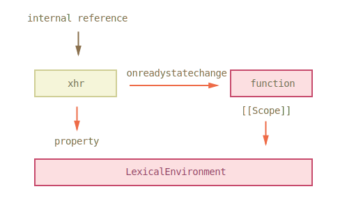
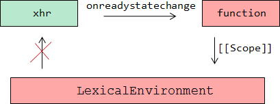

# Утечки памяти 

*Утечки памяти* происходят, когда браузер по какой-то причине не может освободить память от недостижимых объектов.

Обычно это происходит автоматически ([](/memory-management)). Кроме того, браузер освобождает память при переходе на другую страницу. Поэтому утечки в реальной жизни проявляют себя в двух ситуациях:

[cut]
<ol>
<li>Приложение, в котором посетитель все время на одной странице и работает со сложным JavaScript-интерфейсом. В этом случае утечки могут постепенно съедать доступную память.</li>
<li>Страница регулярно делает что-то, вызывающее утечку памяти. Посетитель (например, менеджер) оставляет компьютер на ночь включенным, чтобы не закрывать браузер с кучей вкладок. Приходит утром -- а браузер съел всю память <strike>и рухнул</strike> и сильно тормозит.</li>
</ol>
Утечки бывают из-за ошибок браузера, ошибок в расширениях браузера и, гораздо реже, по причине ошибок в архитектуре JavaScript-кода. Мы разберём несколько наиболее частых и важных примеров.

## Коллекция утечек в IE

### Утечка DOM ↔ JS в IE8-

IE до версии 8 не умел очищать циклические ссылки, появляющиеся между DOM-объектами и объектами JavaScript. В результате и DOM и JS оставались в памяти навсегда.

В браузере IE8 была проведена серьёзная работа над ошибками, но утечка в IE8- появляется, если круговая ссылка возникает "через объект".

Чтобы было понятнее, о чём речь, посмотрите на следующий код. Он вызывает утечку памяти в IE8-:

```
function leak() {
  // Создаём новый DIV, добавляем к BODY
  var elem = document.createElement('div');
  document.body.appendChild(elem);

  // Записываем в свойство жирный объект
  elem.__expando = {
    bigAss: new Array(1000000).join('lalala')
  };

*!*
  // Создаём круговую ссылку. Без этой строки утечки не будет.
  elem.__expando.__elem = elem;
*/!*

  // Удалить элемент из DOM. Браузер должен очистить память.
  elem.parentElement.removeChild(elem);
}
```

Полный пример (только для IE8-, а также IE9 в режиме совместимости с IE8):

[codetabs src="leak-ie8"]


Круговая ссылка и, как следствие, утечка может возникать и неявным образом, через замыкание:

```js
function leak() {
  var elem = document.createElement('div');
  document.body.appendChild(elem);

  elem.__expando = {
    bigAss: new Array(1000000).join('lalala'),
*!*
    method: function() {} // создаётся круговая ссылка через замыкание
*/!*
  };

  // Удалить элемент из DOM. Браузер должен очистить память.
  elem.parentElement.removeChild(elem);
}
```

Полный пример (IE8-, IE9 в режиме совместимости с IE8):

[codetabs src="leak-ie8-2"]

Без привязки метода `method` к элементу здесь утечки не возникнет.

Бывает ли такая ситуация в реальной жизни? Или это -- целиком синтетический пример, для заумных программистов?

Да, конечно бывает. Например, при разработке графических компонент -- бывает удобно присвоить DOM-элементу ссылку на JavaScript-объект, который представляет собой компонент. Это упрощает делегирование и, в общем-то, логично, что DOM-элемент знает о компоненте на себе. Но в IE8- прямая привязка ведёт к утечке памяти!

Примерно так:
```js
function Menu(elem) {
  elem.onclick = function() {};
}

var menu = new Menu(elem); // Menu содержит ссылку на elem
*!*
elem.menu = menu; // такая привязка или что-то подобное ведёт к утечке в IE8
*/!*
```

Полный пример (IE8-, IE9 в режиме совместимости с IE8):

[codetabs src="leak-ie8-widget"]

### Утечка IE8 при обращении к коллекциям таблицы

Эта утечка происходит только в IE8 в стандартном режиме. В нём при обращении к табличным псевдо-массивам (напр. `rows`) создаются и не очищаются внутренние ссылки, что приводит к утечкам.

Также воспроизводится в новых IE в режиме совместимости с IE8.

Код:

```js
var elem = document.createElement('div'); // любой элемент

function leak() {

  elem.innerHTML = '<table><tr><td>1</td></tr></table>';

*!*
  elem.firstChild.rows[0]; // просто доступ через rows[] приводит к утечке
  // при том, что мы даже не сохраняем значение в переменную
*/!*

  elem.removeChild(elem.firstChild); // удалить таблицу (*)
  // alert(elem.childNodes.length) // выдал бы 0, elem очищен, всё честно
}
```

Полный пример (IE8):

[codetabs src="leak-ie8-table"]

Особенности:
<ul>
<li>Если убрать отмеченную строку, то утечки не будет.</li>
<li>Если заменить строку `(*)` на `elem.innerHTML = ''`, то память будет очищена, т.к. этот способ работает по-другому, нежели просто `removeChild` (см. главу [](/memory-management)).</li>
<li>Утечка произойдёт не только при доступе к `rows`, но и к другим свойствам, например `elem.firstChild.tBodies[0]`.</li>
</ul>

Эта утечка проявляется, в частности, при удалении детей элемента следующей функцией:

```js
function empty(elem) {
  while (elem.firstChild) elem.removeChild(elem.firstChild);
}
```

Если идёт доступ к табличным коллекциям и регулярное обновление таблиц при помощи DOM-методов  -- утечка в IE8 будет расти.

Более подробно вы можете почитать об этой утечке в статье [Утечки памяти в IE8, или страшная сказка со счастливым концом](http://habrahabr.ru/post/141451/).

### Утечка через XmlHttpRequest в IE8-
 
Следующий код вызывает утечки памяти в IE8-:

```js
function leak() {
  var xhr = new XMLHttpRequest();

  xhr.open('GET', '/server.do', true);

  xhr.onreadystatechange = function() {
    if (xhr.readyState == 4 && xhr.status == 200) {
      // ...
    }
  }

  xhr.send(null);
}
```

Как вы думаете, почему? Если вы внимательно читали то, что написано выше, то имеете информацию для ответа на этот вопрос..

Посмотрим, какая структура памяти создается при каждом запуске:



Когда запускается асинхронный запрос `xhr`, браузер создаёт специальную внутреннюю ссылку (internal reference) на этот объект. находится в процессе коммуникации. Именно поэтому объект `xhr` будет жив после окончания работы функции.

Когда запрос завершен, браузер удаляет внутреннюю ссылку, `xhr` становится недостижимым и память очищается... Везде, кроме IE8-.


Полный пример (IE8):

[codetabs src="leak-ie8-xhr"]

Чтобы это исправить, нам нужно разорвать круговую ссылку `XMLHttpRequest ↔ JS`. Например, можно удалить `xhr` из замыкания:

```js
function leak() {
  var xhr = new XMLHttpRequest();

  xhr.open('GET', 'something.js?' + Math.random(), true);

  xhr.onreadystatechange = function() {
    if (xhr.readyState != 4) return;

    if (xhr.status == 200) {
      document.getElementById('test').innerHTML++;
    }

*!*
    xhr = null; // по завершении запроса удаляем ссылку из замыкания
*/!*
  }

  xhr.send(null);
}
```



Теперь циклической ссылки нет -- и не будет утечки.


## Объемы утечек памяти

Объем "утекающей" памяти может быть небольшим. Тогда это почти не ощущается. Но так как замыкания ведут к сохранению переменных внешних функций, то одна функция может тянуть за собой много чего ещё.

Представьте, вы создали функцию, и одна из ее переменных содержит очень большую по объему строку (например, получает с сервера).

```js
function f() {
  var data = "Большой объем данных, например, переданных сервером"

  /* делаем что-то хорошее (ну или плохое) с полученными данными */

  function inner() {
    // ...
  }

  return inner;
}
```

Пока функция `inner` остается в памяти, `LexicalEnvironment` с переменной большого объема внутри висит в памяти.

Висит до тех пор, пока функция `inner` жива.

Как правило, JavaScript не знает, какие из переменных функции `inner` будут использованы, поэтому оставляет их все. Исключение -- виртуальная машина V8 (Chrome, Opera, Node.JS), она часто (не всегда) видит, что переменная не используется во внутренних функциях, и очистит память.

В других же интерпретаторах, даже если код спроектирован так, что никакой утечки нет, по вполне разумной причине может создаваться множество функций, а память будет расти потому, что функция тянет за собой своё замыкание. 

Сэкономить память здесь вполне можно. Мы же знаем, что переменная `data` не используется в `inner`. Поэтому просто обнулим её:

```js
function f() {
  var data = "Большое количество данных, например, переданных сервером"

  /* действия с data */

  function inner() {
    // ...
  }

*!*
  data = null; // когда data станет не нужна -
*/!*

  return inner;
}
```

## Поиск и устранение утечек памяти

### Проверка на утечки

Существует множество шаблонов утечек и ошибок в браузерах, которые могут приводить к утечкам. Для их устранения сперва надо постараться изолировать и воспроизвести утечку.

<ul>
<li>**Необходимо помнить, что браузер может очистить память не сразу когда объект стал недостижим, а чуть позже.** Например, сборщик мусора может ждать, пока не будет достигнут определенный лимит использования памяти, или запускаться время от времени.</li>

Поэтому если вы думаете, что нашли проблему и тестовый код, запущенный в цикле, течёт -- подождите примерно минуту, добейтесь, чтобы памяти ело стабильно и много. Тогда будет понятно, что это не особенность сборщика мусора.</li><li>**Если речь об IE, то надо смотреть "Виртуальную память" в списке процессов, а не только обычную "Память".** Обычная может очищаться за счет того, что перемещается в виртуальную (на диск).</li>
<li>Для простоты отладки, если есть подозрение на утечку конкретных объектов, в них добавляют большие свойства-маркеры. Например, подойдет фрагмент текста: `new Array(999999).join('leak')`.</li>
</ul>

### Настройка браузера

Утечки могут возникать из-за расширений браузера, взимодействющих со страницей. Еще более важно, что **утечки могут быть следствием конфликта двух браузерных расширений** Например, было такое: память текла когда включены расширения Skype и плагин антивируса одновременно.

Чтобы понять, в расширениях дело или нет, нужно отключить их:

<ol>
<li>Отключить Flash.</li>
<li>Отключить анивирусную защиту, проверку ссылок и другие модули и дополнения.</li>
<li>Отключить плагины. Отключить ВСЕ плагины.
<ul>
<li>
 Для IE есть параметр коммандной строки:

```
"C:\Program Files\Internet Explorer\iexplore.exe" -extoff
```

Кроме того необходимо отключить сторонние расширения в свойствах IE.


</li>
<li>Firefox необходимо запускать с чистым профилем. Используйте следующую команду для запуска менеджера профилей и создания чистого пустого профиля:

```
firefox --profilemanager
```

</li>
</ul>
</li>
</ol>

## Инструменты

Пожалуй, единственный браузер с поддержкой отладки памяти -- это Chrome. В инструментах разработчика вкладка Timeline -- Memory показывает график использования памяти.


Можем посмотреть, сколько памяти и куда он использует.

Также в Profiles есть кнопка Take Heap Snapshot, здесь можно сделать и исследовать снимок текущего состояния страницы. Снимки можно сравнивать друг с другом, выяснять количество новых объектов. Можно смотреть, почему объект не очищен и кто на него ссылается.

Замечательная статья на эту тему есть в документации: [Chrome Developer Tools: Heap Profiling](http://code.google.com/chrome/devtools/docs/heap-profiling.html).

Утечки памяти штука довольно сложная. В борьбе с ними вам определенно понадобится одна вещь: *Удача!*


