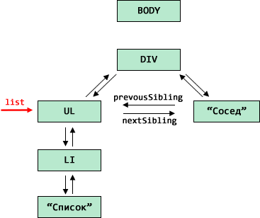
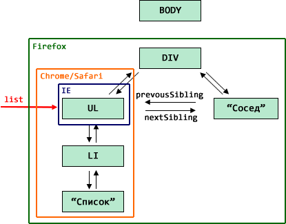

# Очистка памяти при removeChild/innerHTML

Управление памятью в случае с DOM работает по сути так же, как и с обычными JavaScript-объектами. Пока объект достижим -- он остаётся в памяти.

Но есть и особенности, поскольку DOM весь переплетён ссылками. 
[cut]
## Пример
Для примера рассмотрим следующий HTML:

```html
<html>
<body>
  <div>
    <ul>
      <li>Список</li>
    </ul>
    Сосед
  </div>
</body>
</html>
```

Его DOM (показаны только основные ссылки):


## Удаление removeChild 

Операция `removeChild` разрывает все связи удаляемым узлом и его родителем.

Поэтому, если удалить `DIV` из `BODY`, то всё поддерево под `DIV` станет недостижимым и будет удалено.

А что происходит, если на какой-то элемент внутри удаляемого поддерева есть ссылка?

Например, `UL` сохранён в переменную `list`:

```js
var list = document.getElementsByTagName('UL')[0];
document.body.removeChild(document.body.children[0]);
```

В этом случае, так как из этого `UL` можно по ссылкам добраться до любого другого места DOM, то получается, что все объекты по-прежнему достижимы и должны остаться в памяти:



То есть, DOM-объекты при использовании `removeChild` работают по той же логике, что и обычные объекты.

## Удаление через innerHTML

А вот удаление через очистку `elem.innerHTML="..."` браузеры интерпретируют по-разному.

По идее, при присвоении `elem.innerHTML=html` из DOM должны удаляться предыдущие узлы и добавляться новые,  из указанного `html`. Но стандарт ничего не говорит о том, что делать с узлами после удаления. И тут разные браузеры имеют разное мнение.

Посмотрим, что произойдёт с DOM-структурой при очистке `BODY`, если на какой-либо элемент есть ссылка.

```js
var list = document.getElementsByTagName('UL')[0];
document.body.innerHTML = "";
```

Обращаю внимание -- связь разрывается только между `DIV` и `BODY`, т.е. на верхнем уровне, а `list` -- это произвольный элемент.

Чтобы увидеть, что останется в памяти, а что нет -- запустим код:

```html
<!--+ run -->
<div>
  <ul>
    <li>Список</li>
  </ul>
  Сосед
</div>

<script>
  var list = document.getElementsByTagName('ul')[0];
  document.body.innerHTML = ''; // удалили DIV 

  alert(list.parentNode);  // цела ли ссылка UL -> DIV ?
  alert(list.nextSibling); // живы ли соседи UL ?
  alert(list.children.length);  // живы ли потомки UL ?
</script>
```

Как ни странно, браузеры ведут себя по-разному:

<table>
<tr><th></th>
<th>`parentNode`</th>
<th>`nextSibling`</th>
<th>`children.length`</th>
</tr>
<tr>
<td>Chrome/Safari/Opera</td>
<td>`null`</td>
<td>`null`</td>
<td>`1`</td>
</tr>
<tr>
<td>Firefox</td>
<td>узел DOM</td>
<td>узел DOM</td>
<td>`1`</td>
</tr>
<tr>
<td>IE 11-</td>
<td>`null`</td>
<td>`null`</td>
<td>`0`</td>
</tr>
</table>

Иными словами, браузеры ведут себя с различной степенью агрессивности по отношению к элементам.

<dl>
<dt>Firefox</dt>
<dd>Главный пацифист. Оставляет всё, на что есть ссылки, т.е. элемент, его родителя, соседей и детей, в точности как при `removeChild`.</dd>
<dt>Chrome/Safari/Opera</dt>
<dd>Считают, что раз мы задали ссылку на `UL`, то нам нужно только это поддерево, а остальные узлы (соседей, родителей) можно удалить.</dd>
<dt>Internet Explorer</dt>
<dd>Как ни странно, самый агрессивный. Удаляет вообще всё, кроме узла, на который есть ссылка. Это поведение одинаково для всех версий IE.</dd>
</dl>

На иллюстрации ниже показано, какую часть DOM оставит каждый из браузеров:


## Итого

Если на какой-то DOM-узел есть ссылка, то:

<ul>
<li>При использовании `removeChild` на родителе (или на этом узле, не важно) все узлы, достижимые из данного, остаются в памяти. 

То есть, фактически, в памяти может остаться большая часть дерева DOM. Это даёт наибольшую свободу в коде, но может привести к большим "утечкам памяти" из-за сохранения данных, которые реально не нужны.</li>
<li>При удалении через `innerHTML` браузеры ведут себя с различной степенью агрессивности. Кросс-браузерно гарантировано одно: сам узел, на который есть ссылка, останется в памяти.

Поэтому обращаться к соседям и детям узла, предок которого удалён через присвоение `innerHTML`, нельзя.</li>
</ul>


