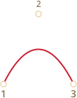
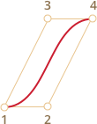
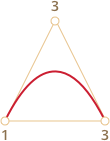
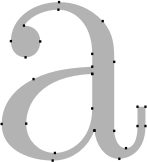
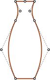
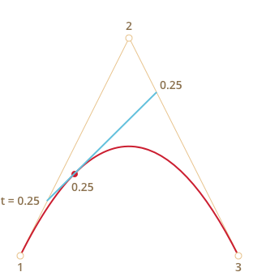
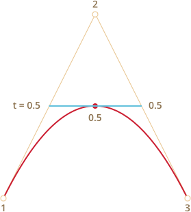

# Bezier curve

Bezier curves are used in computer graphics to draw shapes, for CSS animation and in many other places.

They are a very simple thing, worth to study once and then feel comfortable in the world of vector graphics and advanced animations.

## Control points

A [bezier curve](https://en.wikipedia.org/wiki/B%C3%A9zier_curve) is defined by control points.

There may be 2, 3, 4 or more.

For instance, two points curve:


Three points curve:



Four points curve:


If you look closely at these curves, you can immediately notice:

1. **Points are not always on curve.** That's perfectly normal, later we'll see how the curve is built.
2. **The curve order equals the number of points minus one**.
For two points we have a linear curve (that's a straight line), for three points -- quadratic curve (parabolic), for four points -- cubic curve.
3. **A curve is always inside the [convex hull](https://en.wikipedia.org/wiki/Convex_hull) of control points:**

     

Because of that last property, in computer graphics it's possible to optimize intersection tests. If convex hulls do not intersect, then curves do not either. So checking for the convex hulls intersection first can give a very fast "no intersection" result. Checking the intersection or convex hulls is much easier, because they are rectangles, triangles and so on (see the picture above), much simpler figures than the curve.

**The main value of Bezier curves for drawing -- by moving the points the curve is changing *in intuitively obvious way*.**

Try to move control points using a mouse in the example below:

[iframe src="demo.svg?nocpath=1&p=0,0,0.5,0,0.5,1,1,1" height=370]

**As you can notice, the curve stretches along the tangential lines 1 -> 2 and 3 -> 4.**

After some practice it becomes obvious how to place points to get the needed curve. And by connecting several curves we can get practically anything.

Here are some examples:

  

## De Casteljau's algorithm

There's a mathematical formula for Bezier curves, but let's cover it a bit later, because
[De Casteljau's algorithm](https://en.wikipedia.org/wiki/De_Casteljau%27s_algorithm) it is identical to the mathematical definition and visually shows how it is constructed.

First let's see the 3-points example.

Here's the demo, and the explanation follow.

Control points (1,2 and 3) can be moved by the mouse. Press the "play" button to run it.

[iframe src="demo.svg?p=0,0,0.5,1,1,0&animate=1" height=370]

**De Casteljau's algorithm of building the 3-point bezier curve:**

1. Draw control points. In the demo above they are labeled: `1`, `2`, `3`.
2. Build segments between control points 1 -> 2 -> 3. In the demo above they are <span style="color:#825E28">brown</span>.
3. The parameter `t` moves from `0` to `1`. In the example above the step `0.05` is used: the loop goes over `0, 0.05, 0.1, 0.15, ... 0.95, 1`.

    For each of these values of `t`:

    - On each <span style="color:#825E28">brown</span> segment we take a point located on the distance proportional to `t` from its beginning. As there are two segments, we have two points.

        For instance, for `t=0` -- both points will be at the beginning of segments, and for `t=0.25` -- on the 25% of segment length from the beginning, for `t=0.5` -- 50%(the middle), for `t=1` -- in the end of segments.

    - Connect the points. On the picture below the connecting segment is painted <span style="color:#167490">blue</span>.


| For `t=0.25`             | For `t=0.5`            |
| ------------------------ | ---------------------- |
|    |  |

4. Now in the <span style="color:#167490">blue</span> segment take a point on the distance proportional to the same value of `t`. That is, for `t=0.25` (the left picture) we have a point at the end of the left quarter of the segment, and for `t=0.5` (the right picture) -- in the middle of the segment. On pictures above that point is <span style="color:red">red</span>.

5. As `t` runs from `0` to `1`, every value of `t` adds a point to the curve. The set of such points forms the Bezier curve. It's red and parabolic on the pictures above.

That was a process for 3 points. But the same is for 4 points.

The demo for 4 points (points can be moved by a mouse):

[iframe src="demo.svg?p=0,0,0.5,0,0.5,1,1,1&animate=1" height=370]

The algorithm for 4 points:

- Connect control points by segments: 1 -> 2, 2 -> 3, 3 -> 4. There will be 3 <span style="color:#825E28">brown</span> segments.
- For each `t` in the interval from `0` to `1`:
    - We take points on these segments on the distance proportional to `t` from the beginning. These points are connected, so that we have two <span style="color:#0A0">green segments</span>.
    - On these segments we take points proportional to `t`. We get one <span style="color:#167490">blue segment</span>.
    - On the blue segment we take a point proportional to `t`. On the example above it's <span style="color:red">red</span>.
- These points together form the curve.

The algorithm is recursive and can be generalized for any number of control points.

Given N of control points:

1. We connect them to get initially N-1 segments.
2. Then for each `t` from `0` to `1`, we take a point on each segment on the distance proportional to `t` and connect them. There will be N-2 segments.
3. Repeat step 2 until there is only one point.

These points make the curve.

```online
**Run and pause examples to clearly see the segments and how the curve is built.**
```


A curve that looks like `y=1/t`:

[iframe src="demo.svg?p=0,0,0,0.75,0.25,1,1,1&animate=1" height=370]

Zig-zag control points also work fine:

[iframe src="demo.svg?p=0,0,1,0.5,0,0.5,1,1&animate=1" height=370]

Making a loop is possible:

[iframe src="demo.svg?p=0,0,1,0.5,0,1,0.5,0&animate=1" height=370]

A non-smooth Bezier curve (yeah, that's possible too):

[iframe src="demo.svg?p=0,0,1,1,0,1,1,0&animate=1" height=370]

```online
If there's something unclear in the algorithm description, please look at the live examples above to see how
the curve is built.
```

As the algorithm is recursive, we can build Bezier curves of any order, that is: using 5, 6 or more control points. But in practice many points are less useful. Usually we take 2-3 points, and for complex lines glue several curves together. That's simpler to develop and calculate.

```smart header="How to draw a curve *through* given points?"
To specify a Bezier curve, control points are used. As we can see, they are not on the curve, except the first and the last ones.

Sometimes we have another task: to draw a curve *through several points*, so that all of them are on a single smooth curve. That task is called  [interpolation](https://en.wikipedia.org/wiki/Interpolation), and here we don't cover it.

There are mathematical formulas for such curves, for instance [Lagrange polynomial](https://en.wikipedia.org/wiki/Lagrange_polynomial). In computer graphics [spline interpolation](https://en.wikipedia.org/wiki/Spline_interpolation) is often used to build smooth curves that connect many points.
```


## Maths

A Bezier curve can be described using a mathematical formula.

As we saw -- there's actually no need to know it, most people just draw the curve by moving points with a mouse. But if you're into maths -- here it is.

Given the coordinates of control points <code>P<sub>i</sub></code>: the first control point has coordinates <code>P<sub>1</sub> = (x<sub>1</sub>, y<sub>1</sub>)</code>, the second: <code>P<sub>2</sub> = (x<sub>2</sub>, y<sub>2</sub>)</code>, and so on, the curve coordinates are described by the equation that depends on the parameter `t` from the segment `[0,1]`.

- The formula for a 2-points curve:

    <code>P = (1-t)P<sub>1</sub> + tP<sub>2</sub></code>
- For 3 control points:

    <code>P = (1−t)<sup>2</sup>P<sub>1</sub> + 2(1−t)tP<sub>2</sub> + t<sup>2</sup>P<sub>3</sub></code>
- For 4 control points:

    <code>P = (1−t)<sup>3</sup>P<sub>1</sub> + 3(1−t)<sup>2</sup>tP<sub>2</sub>  +3(1−t)t<sup>2</sup>P<sub>3</sub> + t<sup>3</sup>P<sub>4</sub></code>


These are vector equations. In other words, we can put `x` and `y` instead of `P` to get corresponding coordinates.

For instance, the 3-point curve is formed by points `(x,y)` calculated as:

- <code>x = (1−t)<sup>2</sup>x<sub>1</sub> + 2(1−t)tx<sub>2</sub> + t<sup>2</sup>x<sub>3</sub></code>
- <code>y = (1−t)<sup>2</sup>y<sub>1</sub> + 2(1−t)ty<sub>2</sub> + t<sup>2</sup>y<sub>3</sub></code>

Instead of <code>x<sub>1</sub>, y<sub>1</sub>, x<sub>2</sub>, y<sub>2</sub>, x<sub>3</sub>, y<sub>3</sub></code> we should put coordinates of 3 control points, and then as `t` moves from `0` to `1`, for each value of `t` we'll have `(x,y)` of the curve.

For instance, if control points are  `(0,0)`, `(0.5, 1)` and `(1, 0)`, the equations become:

- <code>x = (1−t)<sup>2</sup> * 0 + 2(1−t)t * 0.5 + t<sup>2</sup> * 1 = (1-t)t + t<sup>2</sup> = t</code>
- <code>y = (1−t)<sup>2</sup> * 0 + 2(1−t)t * 1 + t<sup>2</sup> * 0 = 2(1-t)t = –t<sup>2</sup> + 2t</code>

Now as `t` runs from `0` to `1`, the set of values `(x,y)` for each `t` forms the curve for such control points.

## Summary

Bezier curves are defined by their control points.

We saw two definitions of Bezier curves:

1. Using a drawing process: De Casteljau's algorithm.
2. Using a mathematical formulas.

Good properties of Bezier curves:

- We can draw smooth lines with a mouse by moving control points.
- Complex shapes can be made of several Bezier curves.

Usage:

- In computer graphics, modeling, vector graphic editors. Fonts are described by Bezier curves.
- In web development -- for graphics on Canvas and in the SVG format. By the way, "live" examples above are written in SVG. They are actually a single SVG document that is given different points as parameters. You can open it in a separate window and see the source: [demo.svg](demo.svg?p=0,0,1,0.5,0,0.5,1,1&animate=1).
- In CSS animation to describe the path and speed of animation.
