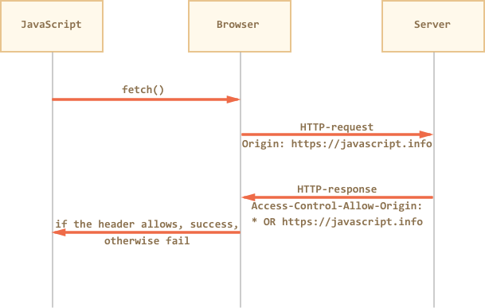
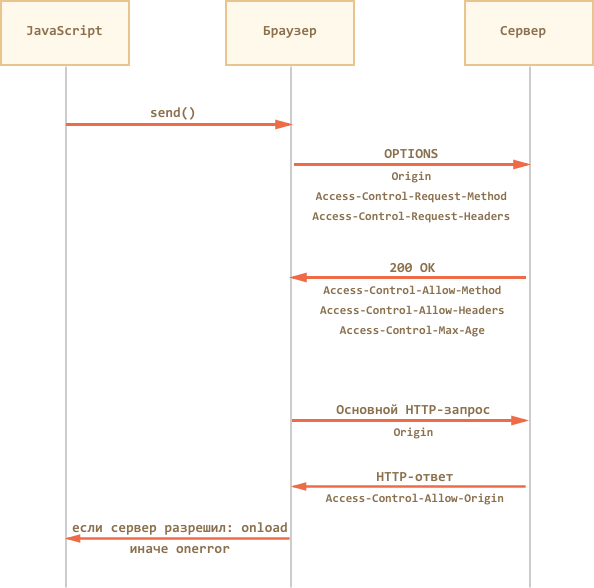

# Cross-Origin Fetch

TODO:
Note that "Content-Length" header is not returned by default for CORS requests

==

Cache-Control
Content-Language
Content-Type
Expires
Last-Modified
Pragma


If we make a `fetch` from an arbitrary web-site, that will probably fail.

Fetching from another origin (domain/port/protocol triplet) requires special headers from the remote side.

For instance, let's try fetching from http://google.com:

```js run async
try {
  await fetch('http://google.com');
} catch(err) {
  alert(err); // Failed to fetch
}
```

Fetch fails, as expected.

## Safety control

Cross-origin requests pass a special safety control, with the sole purpose to protect the internet from evil hackers.

Seriously. For many years cross-domain requests were simply unavailable. The internet got used to it, people got used to it.

Imagine for a second that a new standard appeared, that allows any webpage to make any requests anywhere.

How an evil hacker could use it?

They would create a page at `http://evilhacker.com`, lure a user to it, and run `fetch` from his mail server, e.g. `http://gmail.com`.


When cross-origin requests were finally implemented, safety restrictions were placed to  prevent an evil-minded person from doing anything that they couldn't do before. In such a way, that old sites are automatically protected.

No script could fetch a webpage from another site (another origin, to be precise).

That becomes really important, as you remember about cookies. Any request brings cookies by default, so being able to

 can't access the content of a page from another site.


Кросс-доменные запросы проходят специальный контроль безопасности, цель которого -- не дать злым хакерам(tm) завоевать интернет.

Серьёзно. Разработчики стандарта предусмотрели все заслоны, чтобы "злой хакер" не смог, воспользовавшись новым стандартом, сделать что-то принципиально отличное от того, что и так мог раньше и, таким образом, "сломать" какой-нибудь сервер, работающий по-старому стандарту и не ожидающий ничего принципиально нового.

Давайте, на минуточку, вообразим, что появился стандарт, который даёт, без ограничений, возможность делать любой странице HTTP-запросы куда угодно, какие угодно.

Как сможет этим воспользоваться злой хакер?

Он сделает свой сайт, например `http://evilhacker.com` и заманит туда посетителя (а может посетитель попадёт на "злонамеренную" страницу и по ошибке -- не так важно).

Когда посетитель зайдёт на `http://evilhacker.com`, он автоматически запустит JS-скрипт на странице. Этот скрипт сделает HTTP-запрос на почтовый сервер, к примеру, `http://gmail.com`. А ведь обычно HTTP-запросы идут с куками посетителя и другими авторизующими заголовками.

Поэтому хакер сможет написать на `http://evilhacker.com` код, который, сделав GET-запрос на `http://gmail.com`, получит информацию из почтового ящика посетителя. Проанализирует её, сделает ещё пачку POST-запросов для отправки писем от имени посетителя. Затем настанет очередь онлайн-банка и так далее.

Спецификация [CORS](http://www.w3.org/TR/cors/) налагает специальные ограничения на запросы, которые призваны не допустить подобного апокалипсиса.

Запросы в ней делятся на два вида.

[Простыми](http://www.w3.org/TR/cors/#terminology) считаются запросы, если они удовлетворяют следующим двум условиям:

1. [Простой метод](http://www.w3.org/TR/cors/#simple-method): GET, POST или HEAD
2. [Простые заголовки](http://www.w3.org/TR/cors/#simple-header) -- только из списка:

- `Accept`
- `Accept-Language`
- `Content-Language`
- `Content-Type` со значением `application/x-www-form-urlencoded`, `multipart/form-data` или `text/plain`.

"Непростыми" считаются все остальные, например, запрос с методом `PUT` или с заголовком `Authorization` не подходит под ограничения выше.

Принципиальная разница между ними заключается в том, что "простой" запрос можно сформировать и отправить на сервер и без XMLHttpRequest, например при помощи HTML-формы.

То есть, злой хакер на странице `http://evilhacker.com` и до появления CORS мог отправить произвольный GET-запрос куда угодно. Например, если создать и добавить в документ элемент `<script src="любой url">`, то браузер сделает GET-запрос на этот URL.

Аналогично, злой хакер и ранее мог на своей странице объявить и, при помощи JavaScript, отправить HTML-форму с методом GET/POST и кодировкой `multipart/form-data`. А значит, даже старый сервер наверняка предусматривает возможность таких атак и умеет от них защищаться.

А вот запросы с нестандартными заголовками или с методом `DELETE` таким образом не создать. Поэтому старый сервер может быть к ним не готов. Или, к примеру, он может полагать, что такие запросы веб-страница в принципе не умеет присылать, значит они пришли из привилегированного приложения, и дать им слишком много прав.

Поэтому при посылке "непростых" запросов нужно специальным образом спросить у сервера, согласен ли он в принципе на подобные кросс-доменные запросы или нет? И, если сервер не ответит, что согласен -- значит, нет.

```summary
В спецификации CORS, как мы увидим далее, есть много деталей, но все они объединены единым принципом: новые возможности доступны только с явного согласия сервера (по умолчанию -- нет).
```

## CORS для простых запросов

В кросс-доменный запрос браузер автоматически добавляет заголовок `Origin`, содержащий домен, с которого осуществлён запрос.

В случае запроса на `http://anywhere.com/request` с `http://javascript.ru/page` заголовки будут примерно такие:

```
GET /request
Host:anywhere.com
*!*
Origin:http://javascript.ru
*/!*
...
```

Сервер должен, со своей стороны, ответить специальными заголовками, разрешает ли он такой запрос к себе.

Если сервер разрешает кросс-доменный запрос с этого домена -- он должен добавить к ответу заголовок `Access-Control-Allow-Origin`, содержащий домен запроса (в данном случае "javascript.ru") или  звёздочку `*`.

**Только при наличии такого заголовка в ответе -- браузер сочтёт запрос успешным, а иначе JavaScript получит ошибку.**



То есть, ответ сервера может быть примерно таким:

```
HTTP/1.1 200 OK
Content-Type:text/html; charset=UTF-8
*!*
Access-Control-Allow-Origin: http://javascript.ru
*/!*
```

Если `Access-Control-Allow-Origin` нет, то браузер считает, что разрешение не получено, и завершает запрос с ошибкой.

При таких запросах не передаются куки и заголовки HTTP-авторизации. Параметры `user` и `password` в методе `open` игнорируются. Мы рассмотрим, как разрешить их передачу, чуть далее.

```warn header="Что может сделать хакер, используя такие запросы?"
Описанные выше ограничения приводят к тому, что запрос полностью безопасен.

Действительно, злая страница может сформировать любой GET/POST-запрос и отправить его, но без разрешения сервера ответа она не получит.

А без ответа такой запрос, по сути, эквивалентен отправке формы GET/POST, причём без авторизации.
```

## Ограничения IE9-

В IE9- используется `XDomainRequest`, который представляет собой урезанный `XMLHttpRequest`.

На него действуют ограничения:

- Протокол нужно сохранять: запросы допустимы с HTTP на HTTP, с HTTPS на HTTPS. Другие протоколы запрещены.
- Метод `open(method, url)` имеет только два параметра. Он всегда асинхронный.
- Ряд возможностей современного стандарта недоступны, в частности:
    - Недоступны методы, кроме GET или POST.
    - Нельзя добавлять свои заголовки, даже нельзя указать свой `Content-Type` для запроса, он всегда `text/plain`.
    - Нельзя включить передачу кук и данных HTTP-авторизации.
- В IE8 в режиме просмотра InPrivate кросс-доменные запросы не работают.

Современный стандарт [XMLHttpRequest](http://www.w3.org/TR/XMLHttpRequest/) предусматривает средства для преодоления этих ограничений, но на момент выхода IE8 они ещё не были проработаны, поэтому их не реализовали. А IE9 исправил некоторые ошибки, но в общем не добавил ничего нового.

Поэтому на сайтах, которые хотят поддерживать IE9-, то на практике кросс-доменные запросы редко используют, предпочитая другие способы кросс-доменной коммуникации. Например, динамически создаваемый тег `SCRIPT` или вспомогательный `IFRAME` с другого домена. Мы разберём эти подходы в последующих главах.

```smart header="Как разрешить кросс-доменные запросы от доверенного сайта в IE9-?"
Разрешить кросс-доменные запросы для "доверенных" сайтов можно в настройках IE, во вкладке "Безопасность", включив пункт "Доступ к источникам данных за пределами домена".

Обычно это делается для зоны "Надёжные узлы", после чего в неё вносится доверенный сайт. Теперь он может делать кросс-доменные запросы `XMLHttpRequest`.

Этот способ можно применить для корпоративных сайтов, а также в тех случаях, когда посетитель заведомо вам доверяет, но почему-то (компьютер на работе, админ запрещает ставить другой браузер?) хочет использовать именно IE. Например, он может предлагаться в качестве дополнительной инструкции "как заставить этот сервис работать под IE".
```

```smart header="В IE разрешён другой порт"
В кросс-доменные ограничения IE не включён порт.

То есть, можно сделать запрос с `http://javascript.ru` на `http://javascript.ru:8080`, и в IE он не будет считаться кросс-доменным.

Это позволяет решить некоторые задачи, связанные с взаимодействием различных сервисов в рамках одного сайта. Но только для IE.
```

Расширенные возможности, описанные далее, поддерживаются всеми современными браузерами, кроме IE9-.

## Заголовки ответа

Чтобы JavaScript мог прочитать HTTP-заголовок ответа, сервер должен указать его имя в `Access-Control-Expose-Headers`.

Например:

```
HTTP/1.1 200 OK
Content-Type:text/html; charset=UTF-8
Access-Control-Allow-Origin: http://javascript.ru
*!*
X-Uid: 123
X-Authorization: 2c9de507f2c54aa1
Access-Control-Expose-Headers: X-Uid, X-Authentication
*/!*
```

По умолчанию скрипт может прочитать из ответа только "простые" заголовки:

```
Cache-Control
Content-Language
Content-Type
Expires
Last-Modified
Pragma
```

...То есть, `Content-Type` получить всегда можно, а доступ к специфическим заголовкам нужно открывать явно.

## Запросы от имени пользователя

По умолчанию браузер не передаёт с запросом куки и авторизующие заголовки.

Чтобы браузер передал вместе с запросом куки и HTTP-авторизацию, нужно поставить запросу `xhr.withCredentials = true`:

```js
var xhr = new XMLHttpRequest();
xhr.withCredentials = true;

xhr.open('POST', 'http://anywhere.com/request', true)
  ...
```

Далее -- всё как обычно, дополнительных действий со стороны клиента не требуется.

Такой `XMLHttpRequest` с куками, естественно, требует от сервера больше разрешений, чем "анонимный".

**Поэтому для запросов с `withCredentials` предусмотрено дополнительное подтверждение со стороны сервера.**

При запросе с `withCredentials` сервер должен вернуть уже не один, а два заголовка:

- `Access-Control-Allow-Origin: домен`
- `Access-Control-Allow-Credentials: true`

Пример заголовков:

```js no-beautify
HTTP/1.1 200 OK
Content-Type:text/html; charset=UTF-8
*!*
Access-Control-Allow-Origin: http://javascript.ru
Access-Control-Allow-Credentials: true
*/!*
```

Использование звёздочки `*` в `Access-Control-Allow-Origin` при этом запрещено.

Если этих заголовков не будет, то браузер не даст JavaScript'у доступ к ответу сервера.

## "Непростые" запросы

В кросс-доменном `XMLHttpRequest` можно указать не только `GET/POST`, но и любой другой метод, например `PUT`, `DELETE`.

Когда-то никто и не думал, что страница сможет сделать такие запросы. Поэтому ряд веб-сервисов написаны в предположении, что "если метод -- нестандартный, то это не браузер". Некоторые веб-сервисы даже учитывают это при проверке прав доступа.

Чтобы пресечь любые недопонимания, браузер использует предзапрос в случаях, когда:

- Если метод -- не GET / POST / HEAD.
- Если заголовок `Content-Type` имеет значение отличное от `application/x-www-form-urlencoded`, `multipart/form-data` или `text/plain`, например `application/xml`.
- Если устанавливаются другие HTTP-заголовки, кроме `Accept`, `Accept-Language`, `Content-Language`.

...Любое из условий выше ведёт к тому, что браузер сделает два HTTP-запроса.

Первый запрос называется "предзапрос" (английский термин "preflight"). Браузер делает его целиком по своей инициативе, из JavaScript мы о нём ничего не знаем, хотя можем увидеть в инструментах разработчика.

Этот запрос использует метод `OPTIONS`. Он не содержит тела и содержит название желаемого метода в заголовке `Access-Control-Request-Method`, а если добавлены особые заголовки, то и их тоже -- в `Access-Control-Request-Headers`.

Его задача -- спросить сервер, разрешает ли он использовать выбранный метод и заголовки.

На этот запрос сервер должен ответить статусом 200, без тела ответа, указав заголовки `Access-Control-Allow-Method: метод` и, при необходимости, `Access-Control-Allow-Headers: разрешённые заголовки`.

Дополнительно он может указать `Access-Control-Max-Age: sec`, где `sec` -- количество секунд, на которые нужно закэшировать разрешение. Тогда при последующих вызовах метода браузер уже не будет делать предзапрос.



Давайте рассмотрим предзапрос на конкретном примере.

### Пример запроса COPY

Рассмотрим запрос `COPY`, который используется в протоколе [WebDAV](http://www.webdav.org/specs/rfc2518.html) для управления файлами через HTTP:

```js
var xhr = new XMLHttpRequest();

xhr.open('COPY', 'http://site.com/~ilya', true);
xhr.setRequestHeader('Destination', 'http://site.com/~ilya.bak');

xhr.onload = ...
xhr.onerror = ...

xhr.send();
```

Этот запрос "непростой" по двум причинам (достаточно было бы одной из них):

1. Метод `COPY`.
2. Заголовок `Destination`.

Поэтому браузер, по своей инициативе, шлёт предварительный запрос `OPTIONS`:

```
OPTIONS /~ilya HTTP/1.1
Host: site.com
Accept: text/html,application/xhtml+xml,application/xml;q=0.9,*/*;q=0.8
Accept-Encoding: gzip,deflate
Connection: keep-alive
*!*
Origin: http://javascript.ru
Access-Control-Request-Method: COPY
Access-Control-Request-Headers: Destination
*/!*
```

Обратим внимание на детали:

- Адрес -- тот же, что и у основного запроса: `http://site.com/~ilya`.
- Стандартные заголовки запроса `Accept`, `Accept-Encoding`, `Connection` присутствуют.
- Кросс-доменные специальные заголовки запроса:
    - `Origin` -- домен, с которого сделан запрос.
    - `Access-Control-Request-Method` -- желаемый метод.
    - `Access-Control-Request-Headers` -- желаемый "непростой" заголовок.

На этот запрос сервер должен ответить статусом 200, указав заголовки `Access-Control-Allow-Method: COPY` и `Access-Control-Allow-Headers: Destination`.

Но в протоколе WebDav разрешены многие методы и заголовки, которые имеет смысл сразу перечислить в ответе:

```
HTTP/1.1 200 OK
Content-Type: text/plain
*!*Access-Control-Allow-Methods*/!*: PROPFIND, PROPPATCH, COPY, MOVE, DELETE, MKCOL, LOCK, UNLOCK, PUT, GETLIB, VERSION-CONTROL, CHECKIN, CHECKOUT, UNCHECKOUT, REPORT, UPDATE, CANCELUPLOAD, HEAD, OPTIONS, GET, POST
*!*Access-Control-Allow-Headers*/!*: Overwrite, Destination, Content-Type, Depth, User-Agent, X-File-Size, X-Requested-With, If-Modified-Since, X-File-Name, Cache-Control
*!*Access-Control-Max-Age*/!*: 86400
```

Ответ должен быть без тела, то есть только заголовки.

Браузер видит, что метод `COPY` -- в числе разрешённых и заголовок `Destination` -- тоже, и дальше он шлёт уже основной запрос.

При этом ответ на предзапрос он закэширует на 86400 сек (сутки), так что последующие аналогичные вызовы сразу отправят основной запрос, без `OPTIONS`.

Основной запрос браузер выполняет уже в "обычном" кросс-доменном режиме:

```
COPY /~ilya HTTP/1.1
Host: site.com
Content-Type: text/html; charset=UTF-8
*!*
Destination: http://site.com/~ilya.bak
Origin: http://javascript.ru
*/!*
```

Ответ сервера, согласно спецификации [WebDav COPY](http://www.webdav.org/specs/rfc2518.html#rfc.section.8.8.8), может быть примерно таким:

```
HTTP/1.1 207 Multi-Status
Content-Type: text/xml; charset="utf-8"
Content-Length: ...
*!*
Access-Control-Allow-Origin: http://javascript.ru
*/!*

<?xml version="1.0" encoding="utf-8" ?>
<d:multistatus xmlns:d="DAV:">
  ...
</d:multistatus>
```

Так как `Access-Control-Allow-Origin` содержит правильный домен, то браузер вызовет `xhr.onload` и запрос будет завершён.

## Итого

- Все современные браузеры умеют делать кросс-доменные XMLHttpRequest.
- В IE8,9 для этого используется объект `XDomainRequest`, ограниченный по возможностям.
- Кросс-доменный запрос всегда содержит заголовок `Origin` с доменом запроса.

Порядок выполнения:

1. Для запросов с "непростым" методом или особыми заголовками браузер делает предзапрос `OPTIONS`, указывая их в `Access-Control-Request-Method` и `Access-Control-Request-Headers`.

    Браузер ожидает ответ со статусом `200`, без тела, со списком разрешённых методов и заголовков в `Access-Control-Allow-Method` и `Access-Control-Allow-Headers`. Дополнительно можно указать `Access-Control-Max-Age` для кеширования  предзапроса.
2. Браузер делает запрос и проверяет, есть ли в ответе `Access-Control-Allow-Origin`, равный `*` или `Origin`.

    Для запросов с `withCredentials` может быть только `Origin` и дополнительно `Access-Control-Allow-Credentials: true`.
3. Если проверки пройдены, то вызывается `xhr.onload`, иначе `xhr.onerror`, без деталей ответа.
4. Дополнительно: названия нестандартных заголовков ответа сервер должен указать в `Access-Control-Expose-Headers`, если хочет, чтобы клиент мог их прочитать.

Детали и примеры мы разобрали выше.
