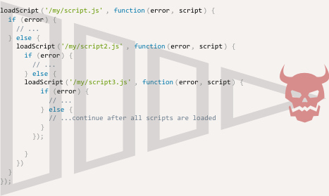

# Callback hell

Many things that we do in JavaScript are asynchronous. We initiate a process, but it finishes later.

The most obvious example is `setTimeout`, but there are others, like making network requests, performing animations and so on.

[cut]

## Callbacks

Consider this function `loadScript(src)` that loads a script:

```js
function loadScript(src) {
  let script = document.createElement('script');
  script.src = src;
  document.head.append(script);
}
```

When the script element is added to the document, the browser loads it and executes. So, the function works.

We can use it like this:

```js
// loads and executes the script
loadScript('/my/script.js');
```

The function is asynchronous: the script starts loading now, but finishes later.

```smart header="Synchronous vs asynchronous"
"Synchonous" and "asynchronous" are general programming terms, not specific to JavaScript.

A *synchronous* action suspends the execution until it's completed. For instance, `alert` and `prompt` are synchronous: the program may not continue until they are finished.

An *asynchronous* action allows the program to continue while it's in progress. For instance, `loadScript` in the example above initiates the script loading, but does not suspend the execution. Other commands may execute while the script is loading.
```

As of now, `loadScript` provides no way to track the load end. How can we execute our own code after the script is loaded?

Let's allow that by adding a custom function as a second argument to `loadScript`, that should execute at that moment:

```js
function loadScript(src, callback) {
  let script = document.createElement('script');
  script.src = src;

  script.onload = () => callback(script);

  document.head.append(script);
}
```

Now when we want to load a script and then do something, we can call:

```js
loadScript('/my/script.js', function(script) {
  alert(`Cool, the ${script.src} is loaded, let's use it`);
});
```

...And it works, shows the `alert` after the script is loaded.

## Callback in callback

What if we need to load two scripts sequentially: the first one, and then the second one after it?

We can put the second `loadScript` inside the callback, like this:

```js
loadScript('/my/script.js', function(script) {

  alert(`Cool, the ${script.src} is loaded, let's load one more`);

*!*
  loadScript('/my/script2.js', function(script) {
    alert(`Cool, the second script is loaded`);
  });
*/!*

});
```

Now after the outer `loadScript` is complete, the callback initiates the inner one.

...What if we want one more script?

```js
loadScript('/my/script.js', function(script) {

  loadScript('/my/script2.js', function(script) {

    if (something) {
*!*
      loadScript('/my/script3.js', function(script) {
        // ...continue after all scripts are loaded
      });
*/!*
    }

  })

});
```

As you can see, a new asynchronous action means one more nesting level.

## Handling errors

In this example we didn't consider errors. What if a script loading failed with an error? Our callback should be able to react on that.

Here's an improved version of `loadScript` that tracks loading errors:

```js run
function loadScript(src, callback) {
  let script = document.createElement('script');
  script.src = src;

*!*
  script.onload = () => callback(null, script);
  script.onerror = () => callback(new Error(`Script load error ` + src));
*/!*

  document.head.append(script);
}
```

It calls `callback(null, script)` for successful load and `callback(error)` otherwise.

Usage:
```js
loadScript('/my/script.js', function(error, script) {
  if (error) {
    // handle error
  } else {
    // script loaded successfully
  }
});
```

The first argument of `callback` is reserved for errors, and the second argument is for the successful result.

## Pyramid of doom

What we've just seen is called a "callback-based" approach to asynchronous programming. We pass a function, and it should run after the process is complete: with an error or a successful result.

From the first look it's a viable way of asynchronous coding. And indeed it is. For one or maybe two nested calls it looks fine.

But for multiple asynchronous actions that follow one after another we'll have a code like this:

```js
loadScript('1.js', function(error, script) {

  if (error) {
    handleError(error);
  } else {
    // ...
    loadScript('2.js', function(error, script) {
      if (error) {
        handleError(error);
      } else {
        // ...
        loadScript('3.js', function(error, script) {
          if (error) {
            handleError(error);
          } else {
  *!*
            // ...continue after all scripts are loaded (*)
  */!*
          }
        });

      }
    })
  }
});
```

In the code above:
1. We load `1.js`, then if there's no error.
2. We load `2.js`, then if there's no error.
3. We load `3.js`, then if there's no error -- do something else `(*)`.

As calls become more nested, the whole thing becomes increasingly more difficult to manage, especially if we add real code instead of `...`, that may include more loops, conditional statements and other usage of loaded scripts.

That's sometimes called "callback hell" or "pyramid of doom".



The pyramid grows to the right with every asynchronous action. Soon it spirales out of control.

Fortunately, there are ways to evade such pyramids. One of them is using "promises", we'll study them in the next chapters.
