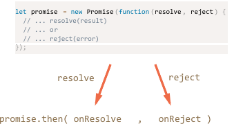

# Promise

There are many ways to explain promises. Here we'll follow the [specification](https://tc39.github.io/ecma262/#sec-promise-objects), because gives real understanding how things work. Besides, you'll become familiar with the terms.

First, what a promise is, and then usage patterns.

[cut]

## Promise objects

A promise is an object of the built-in `Promise` class. It has the meaning of the "delayed result".

The constructor syntax is:

```js
let promise = new Promise(function(resolve, reject) {
  // ...
});
```

The function is called *executor*. It is called automatically when the promise is created and can do an asynchronous job, like loading a script, but can be something else.

At the end, it should call one of:

- `resolve(result)` -- to indicate that the job finished successfully with the `result`.
- `reject(error)` -- to indicate that an error occured, and `error` should be the `Error` object (technically can be any value).

For instance:

```js
let promise = new Promise(function(*!*resolve*/!*, reject) {
  // this function is executed automatically when the promise is constructed
  setTimeout(() => *!*resolve("done!")*/!*, 1000);
});
```

Or, in case of an error:

```js
let promise = new Promise(function(resolve, *!*reject*/!*) {
  setTimeout(() => *!*reject(new Error("Woops!"))*/!*, 1000);
});
```

Initially, the promise is said to have a "pending" state. Then it has two ways. When `resolve` is called, the state becomes "fulfilled". When `reject` is called, the state becomes "rejected":


The idea of promises is that an external code may react on the state change.

The `promise` object  provides the method `promise.then(onResolve, onReject)`.

Both its arguments are functions:

- `onResolve` is called when the state becomes "fulfilled" and gets the result.
- `onReject` is called when the state becomes "rejected" and gets the error.

For instance, here `promise.then` outputs the result when it comes:

```js run
let promise = new Promise(function(resolve, reject) {
  setTimeout(() => resolve("done!"), 1000);
});

// shows "done!" after 1 second
promise.then(result => alert(result));
```

...And here it shows the error message:


```js run
let promise = new Promise(function(resolve, reject) {
  setTimeout(() => reject(new Error("Woops!")), 1000);
});

// shows "Woops!" after 1 second
promise.then(null, error => alert(error.message));
```




- To handle only a result, we can use single argument: `promise.then(onResolve)`
- To handle only an error, we can use a shorthand method `promise.catch(onReject)` -- it's the same as `promise.then(null, onReject)`.

Here's the example rewritten with `promise.catch`:

```js run
let promise = new Promise(function(resolve, reject) {
  setTimeout(() => reject(new Error("Woops!")), 1000);
});

*!*
promise.catch(error => alert(error.message));
*/!*
```

"What's the benefit?" -- one might ask, "How do we use it?" Let's see an example.

## Example: loadScript

We have the `loadScript` function for loading a script from the previous chapter, here's the callback-based variant:

```js
function loadScript(src, callback) {
  let script = document.createElement('script');
  script.src = src;

  script.onload = () => callback(null, script);
  script.onerror = () => callback(new Error(`Script load error ` + src));

  document.head.append(script);
}
```

Let's rewrite it using promises.

The call to `loadScript(src)` below returns a promise that settles when the loading is complete:

```js run
function loadScript(src) {  
  return new Promise(function(resolve, reject) {
    let script = document.createElement('script');
    script.src = src;

    script.onload = () => resolve(script);
    script.onerror = () => reject(new Error("Script load error: " + src));

    document.head.append(script);
  });
}

*!*
// Usage:
*/!*
let promise = loadScript("https://cdnjs.cloudflare.com/ajax/libs/lodash.js/3.2.0/lodash.js");
promise.then(
  script => alert(`${script.src} is loaded!`),
  error => alert(`Error: ${error.message}`);
);
```

The benefits compared to the callback syntax:

- We can add as many `.then` as we want and when we want. Maybe later.
- Also we can pass a promise object somewhere else, and new handlers can be added there, so that's extensible.

So promises already give us flexibility. But there's more. We can chain promises, see the next chapter.


````warn header="Once a promise settles, it can't be changed"
When either `resolve` or `reject` is called -- the promise becomes *settled* (fulfilled or rejected), and the state is final. The result is saved in the promise object.

Future calls of `resolve/reject` are ignored, there's no way to "re-resolve" or "re-reject" a promise.

For instance, here only the first `resolve` works:

```js run
let promise = new Promise(function(resolve, reject) {
  resolve("done!"); // immediately fulfill with the result: "done"

  setTimeout(() => resolve("..."), 1000); // ignored
  setTimeout(() => reject(new Error("..."), 2000));  // ignored
});

// the promise is already fulfilled, so the alert shows up right now
promise.then(result => alert(result), () => alert("Never runs"));
````


```smart header="On settled promises `then` runs immediately"
As we've seen from the example above, a promise may call resolve/reject without delay. That happens sometimes, if it turns out that there's no asynchronous things to be done.

When the promise is settled (resolved or rejected), subsequent `promise.then` callbacks are executed immediately.
```

````smart header="Functions resolve/reject have only one argument"
Functions `resolve/reject` accept only one argument.

We can call them without any arguments: `resolve()`, that makes the result `undefined`:

```js run
let promise = new Promise(function(resolve, reject) {
  resolve();
});

promise.then(result => alert(result)); // undefined
```

...But if we pass more arguments: `resolve(1, 2, 3)`, then all arguments after the first one are ignored. A promise may have only one value as a result/error.

Use objects and destructuring if you need to pass many values, like this:

```js run
let promise = new Promise(function(resolve, reject) {
  resolve({name: "John", age: 25}); // two values packed in an object
});

// destructuring the object into name and age variables
promise.then(function({name, age}) {
  alert(`${name} ${age}`); // John 25
})
```

````
