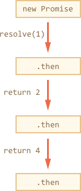
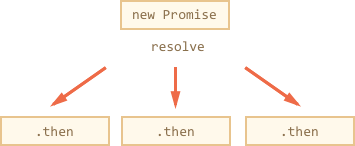
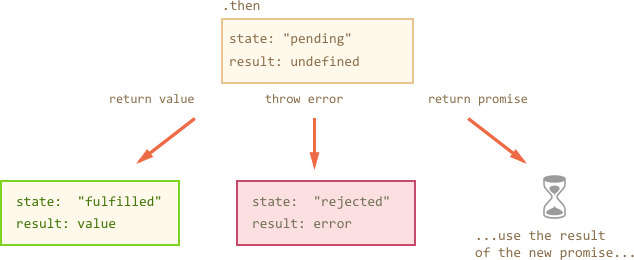

# Promises chaining

Let's formulate the problem mentioned in the chapter <info:callback-hell>:

- We have a sequence of asynchronous tasks to be done one after another. For instance, loading scripts.
- How to code it well?

Promises allow a couple of recipes to do that.

[cut]

In this chapter we cover promise chaining. It looks like this:

```js run
new Promise(function(resolve, reject) {

  setTimeout(() => resolve(1), 1000);

}).then(function(result) {

  alert(result); // 1
  return result * 2;

}).then(function(result) {

  alert(result); // 2
  return result * 2;

}).then(function(result) {

  alert(result); // 4
  return result * 2;

});
```

As we can see:
- A call to `promise.then` returns a promise, that we can use for the next `.then` (chaining).
- A value returned by `.then` handler becomes a result in the next `.then`.



So in the example above we have a sequence of results: `1` -> `2` -> `4`.

Please note the technically we can also add many `.then` to a single promise, without any chaining, like here:

```js run
let promise = new Promise(function(resolve, reject) {
  setTimeout(() => resolve(1), 1000);
});

promise.then(function(result) {
  alert(result); // 1
  return result * 2;
});

promise.then(function(result) {
  alert(result); // 1
  return result * 2;
});

promise.then(function(result) {
  alert(result); // 1
  return result * 2;
});
```

...But that's a totally different thing. All `.then` on the same promise get the same result -- the result of that promise:



So in the code above all `alert` show the same: 1.

In practice chaining is used far more often than adding many handlers to the same promise.

## Returning promises

Normally, a value returned by a handler is passed to the next `.then`. But there's an exception. If the returned value is a promise, then further execution is suspended till it settles. And then the result of that promise is given to the next `.then`.

For instance:

```js run
new Promise(function(resolve, reject) {

  setTimeout(() => resolve(1), 1000);

}).then(function(result) {

  alert(result); // 1

*!*
  return new Promise((resolve, reject) => {
    setTimeout(() => resolve(result * 2), 1000);
  });
*/!*

}).then(function(result) {

  alert(result); // 2

*!*
  return new Promise((resolve, reject) => {
    setTimeout(() => resolve(result * 2), 1000);
  });
*/!*

}).then(function(result) {

  alert(result); // 4

});
```

Here each `.then` returns `new Promise(…)`. JavaScript awaits for it to settle and then passes on the result.

So the output is again 1 -> 2 > 4, but with 1 second delay between `alert` calls.

````smart header="Thenables"
To be precise, any object that has a method `.then` is treated as a promise here. So that we could use a custom "promise-compatible" object in the chain. Such objects are called "thenable".

Here's an example:

```js run
let thenable = {
  then(resolve, reject) {
    setTimeout(() => resolve(result * 2), 1000);
  }
};

new Promise(resolve => resolve(1))
  .then(result => {
    return thenable;
  })
  .then(alert); // shows 2 after 1000ms
```
In practice we rarely need thenables, because if we want to make our own promise-compatible objects, then we can  inherit from the native `Promise` class.

But that's still good, because gives us additional flexibility. We don't *have* to inherit from `Promise`. In particular, that allows to use a custom implementations of promises coming from 3rd-party libraries along with native promises.
````

## Example: loadScript

Let's use it with `loadScript` to load scripts one by one, in sequence:

```js run
loadScript("/article/promise-chaining/one.js")
  .then(function(script) {
    return loadScript("/article/promise-chaining/two.js");
  })
  .then(function(script) {
    return loadScript("/article/promise-chaining/three.js");
  })
  .then(function(script) {
    // use functions declared in scripts
    // to show that they indeed loaded
    one();
    two();
    three();
  });
```

Here each `loadScript` call returns a promise, and the next `.then` awaits until it resolves. So scripts are loaded one after another.

We can add more asynchronous actions to the chain, and the code is still "flat", no signs of "pyramid of doom".

## Error handling

Asynchronous actions do not always succeed. For instance, `loadScript` fails if there's no such script.

Luckily, chaining is great for handling errors. When a promise rejects, the control jumps to the closest rejection handler down the chain.

In the example below we append `.catch` to handle all errors in the scripts loading chain:

```js run
*!*
loadScript("/article/promise-chaining/ERROR.js")
*/!*
  .then(function(script) {
    return loadScript("/article/promise-chaining/two.js");
  })
  .then(function(script) {
    return loadScript("/article/promise-chaining/three.js");
  })
  .then(function(script) {
    alert('done!');
  })
*!*
  .catch(function(error) { // (*)
    alert(error.message);
  });
*/!*
```

In the code above the first `loadScript` call fails, because `ERROR.js` doesn't exist. The control jumps to the closest error handler `(*)`.

The same error handler is called if an error occurs in the second script:


```js run
loadScript("/article/promise-chaining/one.js")
  .then(function(script) {
*!*
    return loadScript("/article/promise-chaining/ERROR.js");
*/!*
  })
  .then(function(script) {
    return loadScript("/article/promise-chaining/three.js");
  })
  .then(function(script) {
    alert('done!');
  })
*!*
  .catch(function(error) {
    alert(error.message);
  });
*/!*
```

The `.catch` works like in a `try..catch` block. We may have as many `.then` as we want, and then use a single `.catch` at the end to handle errors in all of them.


## Implicit try..catch

Promises automatically take care about errors thrown inside them.

That's like an executor and handlers have invisible `try..catch` around them. If an error happens, it's considered a rejection.

For instance, this code:

```js run
new Promise(function(resolve, reject) {
*!*
  throw new Error("Whoops!");
*/!*
}).catch(function(error) {
  alert(error.message); // Whoops!
});
```

...Works the same way as this:

```js run
new Promise(function(resolve, reject) {
*!*
  reject(new Error("Whoops!"));
*/!*  
}).catch(function(error) {
  alert(error.message); // Whoops!
});
```

The `Promise` constructor automatically catches the error and treats it as a rejection.

That works not only in the executor, but in handlers as well. If we `throw` inside `.then` handler, that means a rejected promise, so the control jumps to the nearest error handler.

Here's an example:

```js run
new Promise(function(resolve, reject) {
  resolve("ok");
}).then(function(result) {
*!*
  // .then returns a rejected promise
  throw new Error("Whoops!");
*/!*
}).catch(function(error) {
  // and the error is handled here
  alert(error.message); // Whoops!
});
```

That's so not only for `throw`, but for any errors, including programming errors as well:

```js run
new Promise(function(resolve, reject) {
  resolve("ok");
}).then(function(result) {
*!*
  blabla(); // no such function
*/!*
}).catch(function(error) {
  alert(error.message); // blabla is not defined
});
```

To summarize, a `.then` handler can finish in three ways:

1. It can return a value (or undefined if there's no `return`). Then the promise returned by `.then` becomes fulfilled, and the next handler is called with that value.
2. It can throw an error. Then the promise returned by `.then` becomes rejected and the closest rejection handler is called.
3. It can return a promise. Then JavaScript awaits its result and goes on with it.



## Rethrowing

As we already noticed, `.catch` behaves like `try..catch`. We may have as many `.then` as we want, and then use a single `.catch` at the end to handle errors in all of them.

In a regular `try..catch` we can analyze the error and maybe rethrow it if can't handle. The same thing is possible for promises.

An error handler has the same 3 outcomes as described above. So if we `throw` inside `.catch`, then the control goes to the next closest error handler. And if we finish normally, then it continues to TODO

TODO TODO
Here is an example of the first behavior (the error is handled):

```js run
// the execution: catch -> then
new Promise(function(resolve, reject) {

  throw new Error("Whoops!");

}).catch(function(error) {

  alert("Handled it!");
*!*
  return "result"; // return, the execution goes the "normal way"
*/!*

*!*
}).then(alert); // result shown
*/!*
```

...And here's an example of "rethrowing":


```js run
// the execution: catch -> catch -> then
new Promise(function(resolve, reject) {

  throw new Error("Whoops!");

}).catch(function(error) {

  alert("Can't handle!");
*!*
  throw error; // throwing this or another error jumps to the next catch
*/!*

}).catch(error => {

  alert("Trying to handle again...");
  // don't return anything => execution goes the normal way

}).then(alert); // undefined
```

## Unhandled rejections

What if we forget to handle an error?

Like here:

```js untrusted run refresh
new Promise(function() {
  errorHappened(); // Error here (no such function)
});
```

Or here:

```js untrusted run refresh
new Promise(function() {
  throw new Error("Whoops!");
}).then(function() {
  // ...something...
}).then(function() {
  // ...something else...
}).then(function() {
  // ...but no catch after it!
});
```

Technically, when an error happens, the promise state becomes "rejected", and the execution should jump to the closest rejection handler. But there is none.

Usually that means that the code is bad. Most JavaScript engines track such situations and generate a global error. In the browser we can catch it using `window.addEventListener('unhandledrejection')` (as specified in the [HTML standard](https://html.spec.whatwg.org/multipage/webappapis.html#unhandled-promise-rejections)):


```js run
// open in a new window to see in action

window.addEventListener('unhandledrejection', function(event) {
  // the event object has two special properties:
  alert(event.promise); // the promise that generated the error
  alert(event.reason); // the error itself (Whoops!)
});

new Promise(function() {
  throw new Error("Whoops!");
}).then(function() {
  // ...something...
}).then(function() {
  // ...something else...
}).then(function() {
  // ...but no catch after it!
});
```

In non-browser environments there's also a similar event, so we can always track unhandled errors in promises.
