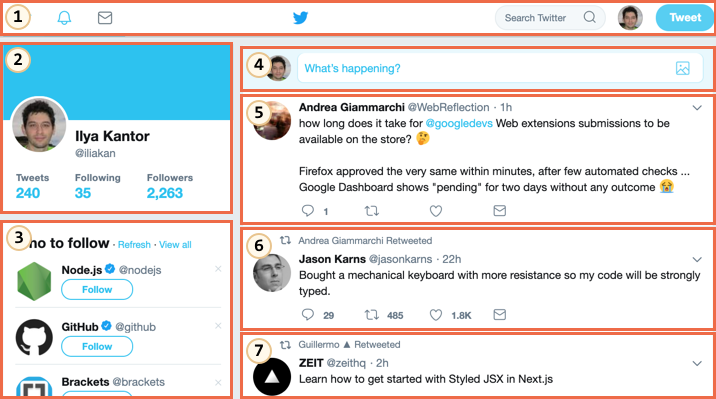

# From the orbital height

This section describes a set of modern standards for "web components".

As of now, these standards are under development. Some features are well-supported and integrated into the modern HTML/DOM standard, while others are yet in draft stage. You can try examples in any browser, Google Chrome is probably the most up to date with these features. Guess, that's because Google fellows are behind many of the related specifications.

## What's common between...

The whole component idea is nothing new. It's used in many frameworks and elsewhere.

Before we move to implementation details, take a look at this great achievement of humanity:

That's the International Space Station (ISS).

And this is how it's made inside (approximately):

The International Space Station:
- Consists of many components.
- Each component, in its turn, has many smaller details inside.
- The components are very complex, much more complicated than most websites.
- Components are developed internationally, by teams from different countries, speaking different languages.

...And this thing flies, keeps humans alive in space!

How such complex devices are created?

Which principles we could borrow to make our development same-level reliable and scalable? Or, at least, close to it.

## Component architecture

The well known rule for developing complex software is: don't make complex software.

If something becomes complex -- split it into simpler parts and connect in the most obvious way.

**A good architect is the one who can make the complex simple.**

We can split user interface into visual components: each of them has own place on the page, can "do" a well-described task, and is separate from the others.

Let's take a look at a website, for example Twitter.

It naturally splits into components:

1. Top navigation.
2. User info.
3. Follow suggestions.
4. Submit form.
5. (and also 6, 7) -- messages.

Components may have subcomponents, e.g. messages may be parts of a higher-level "message list" component. A clickable user picture itself may be a component, and so on.

How do we decide, what is a component? That comes from intuition, experience and common sense. Usually it's a separate visual entity that we can describe in terms of what it does and how it interacts with the page. In the case above, the page has blocks, each of them plays its own role, it's logical to make these components.

- A component has its own JavaScript class.
- DOM structure, managed solely by its class, outside code doesn't access it ("encapsulation" principle).
- CSS styles, applied to the component.
- API: events, class methods etc, to interact with other components.

Once again, the whole "component" thing is nothing special.

There exist many frameworks and development methodologies to build them, each one with its own bells and whistles. Usually, special CSS classes and conventions are used to provide "component feel" -- CSS scoping and DOM encapsulation.

"Web components" provide built-in browser capabilities for that, so we don't have to emulate them any more.

- [Custom elements](https://html.spec.whatwg.org/multipage/custom-elements.html#custom-elements) -- to define custom HTML elements.
- [Shadow DOM](https://dom.spec.whatwg.org/#shadow-trees) -- to create an internal DOM for the component, hidden from the others.
- [CSS Scoping](https://drafts.csswg.org/css-scoping/) -- to declare styles that only apply inside the Shadow DOM of the component.
- [Event retargeting](https://dom.spec.whatwg.org/#retarget) and other minor stuff to make custom components better fit the development.

In the next chapter we'll go into details of "Custom Elements" -- the fundamental and well-supported feature of web components, good on its own.
