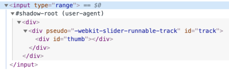
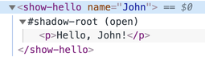

# Shadow DOM

Shadow DOM serves for encapsulation. It allows a component to have its very own "shadow" DOM tree, that can't be accidentally accessed from the main document, may have local style rules, and more.

## Built-in shadow DOM

Did you ever think how complex browser controls are created and styled?

Such as `<input type="range">`:

<p>
<input type="range">
</p>

The browser uses DOM/CSS internally to draw them. That DOM structure is normally hidden from us, but we can see it in developer tools. E.g. in Chrome, we need to enable in Dev Tools "Show user agent shadow DOM" option.

Then `<input type="range">` looks like this:



What you see under `#shadow-root` is called "shadow DOM".

We can't get built-in shadow DOM elements by regular JavaScript calls or selectors. These are not regular children, but a powerful encapsulation technique.

In the example above, we can see a useful attribute `pseudo`. It's non-standard, exists for historical reasons. We can use it style subelements with CSS, like this:

```html run autorun
<style>
/* make the slider track red */
input::-webkit-slider-runnable-track {
  background: red;
}
</style>

<input type="range">
```

Once again, `pseudo` is a non-standard attribute. Chronologically, browsers first started to experiment with internal DOM structures to implement controls, and then, after time, shadow DOM was standardized to allow us, developers, to do the similar thing.

Further on, we'll use the modern shadow DOM standard, covered by [DOM spec](https://dom.spec.whatwg.org/#shadow-trees) other related specifications.

## Shadow tree

A DOM element can have two types of DOM subtrees:

1. Light tree -- a regular DOM subtree, made of HTML children. All subtrees that we've seen in previous chapters were "light".
2. Shadow tree -- a hidden DOM subtree, not reflected in HTML, hidden from prying eyes.

If an element has both, then the browser renders only the shadow tree. But we can setup a kind of composition between shadow and light trees as well. We'll see the details later in the chapter <info:slots-composition>.

Shadow tree can be used in Custom Elements to hide component internals and apply component-local styles.

For example, this `<show-hello>` element hides its internal DOM in shadow tree:

```html run autorun height=60
<script>
customElements.define('show-hello', class extends HTMLElement {
  connectedCallback() {
    const shadow = this.attachShadow({mode: 'open'});
    shadow.innerHTML = `<p>
      Hello, ${this.getAttribute('name')}
    </p>`;
  }  
});
</script>

<show-hello name="John"></show-hello>
```

That's how the resulting DOM looks in Chrome dev tools, all the content is under "#shadow-root":



First, the call to `elem.attachShadow({mode: …})` creates a shadow tree.

There are two limitations:
1. We can create only one shadow root per element.
2. The `elem` must be either a custom element, or one of: "article", "aside", "blockquote", "body", "div", "footer", "h1..h6", "header", "main" "nav", "p", "section", or "span". Other elements, like ``, can't host shadow tree.

The `mode` option sets the encapsulation level. It must have any of two values:
- `"open"` -- the shadow root is available as `elem.shadowRoot`.

    Any code is able to access the shadow tree of `elem`.   
- `"closed"` -- `elem.shadowRoot` is always `null`.

    We can only access the shadow DOM by the reference returned by `attachShadow` (and probably hidden inside a class). Browser-native shadow trees, such as  `<input type="range">`, are closed. There's no way to access them.

The [shadow root](https://dom.spec.whatwg.org/#shadowroot), returned by `attachShadow`, is like an element: we can use `innerHTML` or DOM methods, such as `append`, to populate it.

The element with a shadow root is called a "shadow tree host", and is available as the shadow root `host` property:

```js
// assuming {mode: "open"}, otherwise elem.shadowRoot is null
alert(elem.shadowRoot.host === elem); // true
```

## Encapsulation

Shadow DOM is strongly delimited from the main document:

1. Shadow DOM elements are not visible to `querySelector` from the light DOM. In particular,  Shadow DOM elements may have ids that conflict with those in the light DOM. They must be unique only within the shadow tree.
2. Shadow DOM has own stylesheets. Style rules from the outer DOM don't get applied.

For example:

```html run untrusted height=40
<style>
*!*
  /* document style won't apply to the shadow tree inside #elem (1) */
*/!*
  p { color: red; }
</style>

<div id="elem"></div>

<script>
  elem.attachShadow({mode: 'open'});
*!*
    // shadow tree has its own style (2)
*/!*
  elem.shadowRoot.innerHTML = `
    <style> p { font-weight: bold; } </style>
    <p>Hello, John!</p>
  `;

*!*
  // <p> is only visible from queries inside the shadow tree (3)
*/!*
  alert(document.querySelectorAll('p').length); // 0
  alert(elem.shadowRoot.querySelectorAll('p').length); // 1
</script>  
```

1. The style from the document does not affect the shadow tree.
2. ...But the style from the inside works.
3. To get elements in shadow tree, we must query from inside the tree.

## References

- DOM: <https://dom.spec.whatwg.org/#shadow-trees>
- Compatibility: <https://caniuse.com/#feat=shadowdomv1>
- Shadow DOM is mentioned in many other specifications, e.g. [DOM Parsing](https://w3c.github.io/DOM-Parsing/#the-innerhtml-mixin) specifies that shadow root has `innerHTML`.


## Summary

Shadow DOM is a way to create a component-local DOM.

1. `shadowRoot = elem.attachShadow({mode: open|closed})` -- creates shadow DOM for `elem`. If `mode="open"`, then it's accessible as `elem.shadowRoot` property.
2. We can populate `shadowRoot` using `innerHTML` or other DOM methods.

Shadow DOM elements:
- Have their own ids space,
- Invisible to JavaScript selectors from the main document, such as `querySelector`,
- Use styles only from the shadow tree, not from the main document.

Shadow DOM, if exists, is rendered by the browser instead of so-called "light DOM" (regular children). In the chapter <info:slots-composition> we'll see how to compose them.
