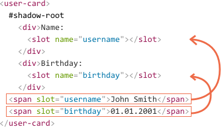

# Shadow DOM slots, composition

Our components should be generic. For instance, when we create a `<custom-tabs>` or `<custom-menu>`, we need to let others will it with data.

The code that makes use of `<custom-menu>` can look like this:

```html
<custom-menu>
  <title>Candy menu</title>
  <item>Lollipop</item>
  <item>Fruit Toast</item>
  <item>Cup Cake</item>
</custom-menu>
```

...Then our component should render it properly, as a nice menu with event handlers etc.

How to implement it?

One way is to analyze the element content and dynamically copy-rearrange DOM nodes. That's posssible, but requires some coding. Also, if we're moving things to shadow DOM, then CSS styles from the document do not apply any more, so the visual styling may be lost.

Another way is to use `<slot>` elements in shadow DOM. They allow to specify content in light DOM that the browser renders in component slots.

It's easy to grasp by example.

## Named slots

Here, `<user-card>` shadow DOM provides two slots, and the component user should fill them:

```html run autorun="no-epub" untrusted height=80
<script>
customElements.define('user-card', class extends HTMLElement {
  connectedCallback() {
    this.attachShadow({mode: 'open'});
    this.shadowRoot.innerHTML = `
      <div>Name:
*!*
        <slot name="username"></slot>
*/!*
      </div>
      <div>Birthday:
*!*
        <slot name="birthday"></slot>
*/!*
      </div>
    `;
  }
});
</script>

<user-card>
  <span *!*slot="username"*/!*>John Smith</span>
  <span *!*slot="birthday"*/!*>01.01.2001</span>
</user-card>
```

In shadow DOM `<slot name="X">` defines an "insertion point", a place where the elements with `slot="X"` are rendered.

The process of re-rendering light DOM inside shadow DOM is rather untypical, so let's go into details.

First, after the script has finished we created the shadow DOM, leading to this DOM structure:

```html
<user-card>
  #shadow-root
    <div>Name:
      <slot name="username"></slot>
    </div>
    <div>Birthday:
      <slot name="birthday"></slot>
    </div>
  <span slot="username">John Smith</span>
  <span slot="birthday">01.01.2001</span>
</user-card>
```

Now the element has both light and shadow DOM. In such case only shadow DOM is rendered.

After that, for each `<slot name="...">` in shadow DOM, the browser looks for `slot="..."` with the same name in the light DOM.

These elements are rendered -- as a whole, inside the slots:



At the end, the so-called "flattened" DOM looks like this:

```html
<user-card>
  #shadow-root
    <div>Name:
      <slot name="username">
        <span slot="username">John Smith</span>
      </slot>
    </div>
    <div>Birthday:
      <slot name="birthday">
        <span slot="birthday">01.01.2001</span>
      </slot>
    </div>
</user-card>
```

So, slotted content fills its containers.

...But the nodes are actually not moved around! That can be easily checked if we run `querySelector`: nodes are still at their places.

```js
// light DOM nodes <span> are physically at place
alert( document.querySelector('user-card span').length ); // 2
```

It looks bizarre indeed, from the first sight, but so it is. The browser renders nodes from light DOM inside the shadow DOM.

````smart header="Slot default content"
If we put something inside a `<slot>`, it becomes the default content. The browser shows it if there's no corresponding filler in light DOM.

For example, in this piece of shadow DOM, `Anonymous` renders if there's no `slot="username"` in corresponding light DOM.

```html
<div>Name:
  <slot name="username">Anonymous</slot>
</div>
```
````

````warn header="Only top-level children may have slot=\"...\" attribute"
The `slot="..."` attribute is only valid for direct children of the shadow host (in our example, `<user-card>` element). For nested elements it's ignored.

For example, the second `<span>` here is ignored (as it's not a top-level child of `<user-card>`):
```
<user-card>
  <span slot="username">John Smith</span>
  <div><span slot="birthday">01.01.2001</span></div>
</user-card>
```

In practice, there's no sense in slotting a deeply nested element, so this limitation just ensures the correct DOM structure.
````

## Default slot

The first `<slot>` in shadow DOM that doesn't have a name is a "default" slot.

It gets any data from the light DOM that isn't slotted elsewhere.

For example, let's add a "bio" field to our `<user-card>` that collects any unslotted information about the user:

```html run autorun="no-epub" untrusted height=140
<script>
customElements.define('user-card', class extends HTMLElement {
  connectedCallback() {
    this.attachShadow({mode: 'open'});
    this.shadowRoot.innerHTML = `
    <div>Name:
      <slot name="username"></slot>
    </div>
    <div>Birthday:
      <slot name="birthday"></slot>
    </div>
    <fieldset>
      <legend>About me</legend>
*!*
      <slot></slot>
*/!*
    </fieldset>
    `;
  }
});
</script>

<user-card>
*!*
  <div>Hello</div>
*/!*
  <span slot="username">John Smith</span>
  <span slot="birthday">01.01.2001</span>
*!*
  <div>I am John!</div>
*/!*
</user-card>
```

All the unslotted light DOM content gets into the `<fieldset>`.

Elements are appended to the slot one after another, so the flattened DOM looks like this:

```html
<user-card>
  #shadow-root
    <div>Name:
      <slot name="username">
        <span slot="username">John Smith</span>
      </slot>
    </div>
    <div>Birthday:
      <slot name="birthday">
        <span slot="birthday">01.01.2001</span>
      </slot>
    </div>
*!*
    <fieldset>
      <legend>About me</legend>
      <slot>
        <div>Hello</div>
        <div>I am John!</div>
      </slot>
    </fieldset>
*/!*
</user-card>
```

## Menu example

Now let's back to `<custom-menu>`, mentioned at the beginning of the chapter.

We can use slots to distribute elements: title and items:

```html
<custom-menu>
  <span slot="title">Candy menu</span>
  <li slot="item">Lollipop</li>
  <li slot="item">Fruit Toast</li>
  <li slot="item">Cup Cake</li>
</custom-menu>
```

The shadow DOM template:

```html
<template id="tmpl">
  <style> /* menu styles */ </style>
  <div class="menu">
    <slot name="title"></slot>
    <ul><slot name="item"></slot></ul>
  </div>
</template>
```

As you can see, for `<slot name="item">` there are multiple `<li>` elements in light DOM, with the same `slot="item"`. In that case they all get appended to the slot, one after another.

So the flattened DOM becomes:

```html
<div class="menu">
  <slot name="title">
    <span slot="title">Candy menu</span>
  </slot>
  <ul>
    <slot name="item">
      <li slot="item">Lollipop</li>
      <li slot="item">Fruit Toast</li>
      <li slot="item">Cup Cake</li>
    </slot>
  </ul>
</div>
```

One might notice that, in a valid DOM, `<li>` must be a direct child of `<ul>`, so we have an oddity here. But that's flattened DOM, it describes how the component is rendered. Physically nodes are still at their places.

We just need to add an `onclick` handler, and the custom element is ready:

```js
customElements.define('custom-menu', class extends HTMLElement {
  connectedCallback() {
    this.attachShadow({mode: 'open'});

    // tmpl is the shadow DOM template (above)
    this.shadowRoot.append( tmpl.content.cloneNode(true) );

    // we can't select light DOM nodes, so let's handle clicks on the slot
    this.shadowRoot.querySelector('slot[name="title"]').onclick = () => {
      // open/close the menu
      this.shadowRoot.querySelector('.menu').classList.toggle('closed');
    };
  }
});
```

Here's the full demo:

[iframe src="menu" height=140 edit]

Now, as we have elements from light DOM in the shadow DOM, styles from the document and shadow DOM can mix. There are few simple rules for that. We'll see the details in the next chapter.


## Итого

Shadow DOM -- это средство для создания отдельного DOM-дерева внутри элемента, которое не видно снаружи без применения специальных методов.

- Ряд браузерных элементов со сложной структурой уже имеют Shadow DOM.
- Можно создать Shadow DOM внутри любого элемента вызовом `elem.createShadowRoot()`. В дальнейшем его корень будет доступен как `elem.shadowRoot`. У встроенных элементов он недоступен.
- Как только у элемента появляется Shadow DOM, его изначальное содержимое скрывается. Теперь показывается только Shadow DOM, который может указать, какое содержимое хозяина куда вставлять, при помощи элемента `<content>`. Можно указать селектор `<content select="селектор">` и размещать разное содержимое в разных местах Shadow DOM.
- Элемент `<content>` перемещает содержимое исходного элемента в Shadow DOM только визуально, в структуре DOM оно остаётся на тех же местах.

Подробнее спецификация описана по адресу <http://w3c.github.io/webcomponents/spec/shadow/>.

Далее мы рассмотрим работу с шаблонами, которые также являются частью платформы Web Components и не заменяют существующие шаблонные системы, но дополняют их важными встроенными в браузер возможностями.
