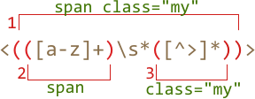

# Capturing groups

A part of a pattern can be enclosed in parentheses `pattern:(...)`. This is called a "capturing group".

That has two effects:

1. It allows to place a part of the match into a separate array.
2. If we put a quantifier after the parentheses, it applies to the parentheses as a whole, not the last character.

## Example

In the example below the pattern `pattern:(go)+` finds one or more `match:'go'`:

```js run
alert( 'Gogogo now!'.match(/(go)+/i) ); // "Gogogo"
```

Without parentheses, the pattern `pattern:/go+/` means `subject:g`, followed by `subject:o` repeated one or more times. For instance, `match:goooo` or `match:gooooooooo`.

Parentheses group the word `pattern:(go)` together.

Let's make something more complex -- a regexp to match an email.

Examples of emails:

```
my@mail.com
john.smith@site.com.uk
```

The pattern: `pattern:[-.\w]+@([\w-]+\.)+[\w-]{2,20}`.

1. The first part `pattern:[-.\w]+` (before `@`) may include any alphanumeric word characters, a dot and a dash, to match `match:john.smith`.
2. Then `pattern:@`, and the domain. It may be a subdomain like `host.site.com.uk`, so we match it as "a word followed by a dot `pattern:([\w-]+\.)` (repeated), and then the last part must be a word: `match:com` or `match:uk` (but not very long: 2-20 characters).

That regexp is not perfect, but good enough to fix errors or occasional mistypes.

For instance,  we can find all emails in the string:

```js run
let reg = /[-.\w]+@([\w-]+\.)+[\w-]{2,20}/g;

alert("my@mail.com @ his@site.com.uk".match(reg)); // my@mail.com, his@site.com.uk
```

In this example parentheses were used to make a group for repeating `pattern:(...)+`. But there are other uses too, let's see them.

## Contents of parentheses  

Parentheses are numbered from left to right. The search engine remembers the content matched by each of them and allows to reference it in the pattern or in the replacement string.

For instance, we'd like to find HTML tags `pattern:<.*?>`, and process them.

Let's wrap the inner content into parentheses, like this: `pattern:<(.*?)>`.

We'll get both the tag as a whole and its content as an array:

```js run
let str = '<h1>Hello, world!</h1>';
let reg = /<(.*?)>/;

alert( str.match(reg) ); // Array: ["<h1>", "h1"]
```

The call to [String#match](mdn:js/String/match) returns groups only if the regexp only looks for the first match, that is: has no `pattern:/.../g` flag.

If we need all matches with their groups then we can use `.matchAll` or `regexp.exec` as described in <info:regexp-methods>:

```js run
let str = '<h1>Hello, world!</h1>';

// two matches: opening <h1> and closing </h1> tags
let reg = /<(.*?)>/g;

let matches = Array.from( str.matchAll(reg) );

alert(matches[0]); //  Array: ["<h1>", "h1"]
alert(matches[1]); //  Array: ["</h1>", "/h1"]
```

Here we have two matches for `pattern:<(.*?)>`, each of them is an array with the full match and groups.

## Nested groups

Parentheses can be nested. In this case the numbering also goes from left to right.

For instance, when searching a tag in `subject:<span class="my">` we may be interested in:

1. The tag content as a whole: `match:span class="my"`.
2. The tag name: `match:span`.
3. The tag attributes: `match:class="my"`.

Let's add parentheses for them:

```js run
let str = '<span class="my">';

let reg = /<(([a-z]+)\s*([^>]*))>/;

let result = str.match(reg);
alert(result); // <span class="my">, span class="my", span, class="my"
```

Here's how groups look:



At the zero index of the `result` is always the full match.

Then groups, numbered from left to right. Whichever opens first gives the first group `result[1]`. Here it encloses the whole tag content.

Then in `result[2]` goes the group from the second opening `pattern:(` till the corresponding `pattern:)` -- tag name, then we don't group spaces, but group attributes for `result[3]`.

**If a group is optional and doesn't exist in the match, the corresponding `result` index is present (and equals `undefined`).**

For instance, let's consider the regexp `pattern:a(z)?(c)?`. It looks for `"a"` optionally followed by `"z"` optionally followed by `"c"`.

If we run it on the string with a single letter `subject:a`, then the result is:

```js run
let match = 'a'.match(/a(z)?(c)?/);

alert( match.length ); // 3
alert( match[0] ); // a (whole match)
alert( match[1] ); // undefined
alert( match[2] ); // undefined
```

The array has the length of `3`, but all groups are empty.

And here's a more complex match for the string `subject:ack`:

```js run
let match = 'ack'.match(/a(z)?(c)?/)

alert( match.length ); // 3
alert( match[0] ); // ac (whole match)
alert( match[1] ); // undefined, because there's nothing for (z)?
alert( match[2] ); // c
```

The array length is permanent: `3`. But there's nothing for the group `pattern:(z)?`, so the result is `["ac", undefined, "c"]`.

## Named groups

Remembering groups by their numbers is hard. For simple patterns it's doable, but for more complex ones we can give names to parentheses.

That's done by putting `pattern:?<name>` immediately after the opening paren, like this:

```js run
*!*
let dateRegexp = /(?<year>[0-9]{4})-(?<month>[0-9]{2})-(?<day>[0-9]{2})/;
*/!*
let str = "2019-04-30";

let groups = str.match(dateRegexp).groups;

alert(groups.year); // 2019
alert(groups.month); // 04
alert(groups.day); // 30
```

As you can see, the groups reside in the `.groups` property of the match.

We can also use them in the replacement string, as `pattern:$<name>` (like `$1..9`, but a name instead of a digit).

For instance, let's reformat the date into `day.month.year`:

```js run
let dateRegexp = /(?<year>[0-9]{4})-(?<month>[0-9]{2})-(?<day>[0-9]{2})/;

let str = "2019-04-30";

let rearranged = str.replace(dateRegexp, '$<day>.$<month>.$<year>');

alert(rearranged); // 30.04.2019
```

If we use a function for the replacement, then named `groups` object is always the last argument:

```js run
let dateRegexp = /(?<year>[0-9]{4})-(?<month>[0-9]{2})-(?<day>[0-9]{2})/;

let str = "2019-04-30";

let rearranged = str.replace(dateRegexp,
  (str, year, month, day, offset, input, groups) =>
   `${groups.day}.${groups.month}.${groups.year}`
);

alert(rearranged); // 30.04.2019
```

Usually, when we intend to use named groups, we don't need positional arguments of the function. For the majority of real-life cases we only need `str` and `groups`.

So we can write it a little bit shorter:

```js
let rearranged = str.replace(dateRegexp, (str, ...args) => {
  let {year, month, day} = args.pop();
  alert(str); // 2019-04-30
  alert(year); // 2019
  alert(month); // 04
  alert(day); // 30
});
```


## Non-capturing groups with ?:

Sometimes we need parentheses to correctly apply a quantifier, but we don't want the contents in results.

A group may be excluded by adding `pattern:?:` in the beginning.

For instance, if we want to find `pattern:(go)+`, but don't want to remember the contents (`go`) in a separate array item, we can write: `pattern:(?:go)+`.

In the example below we only get the name "John" as a separate member of the `results` array:

```js run
let str = "Gogo John!";
*!*
// exclude Gogo from capturing
let reg = /(?:go)+ (\w+)/i;
*/!*

let result = str.match(reg);

alert( result.length ); // 2
alert( result[1] ); // John
```

## Summary

Parentheses group together a part of the regular expression, so that the quantifier applies to it as a whole.

Parentheses groups are numbered left-to-right, and can optionally be named with  `(?<name>...)`.

The content, matched by a group, can be referenced both in the replacement string as `$1`, `$2` etc, or by the name `$name` if named.

So, parentheses groups are called "capturing groups", as they "capture" a part of the match. We get that part separately from the result as a member of the array or in `.groups` if it's named.

We can exclude the group from remembering (make in "non-capturing") by putting `?:` at the start: `(?:...)`, that's used if we'd like to apply a quantifier to the whole group, but don't need it in the result.
