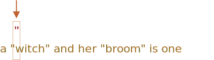
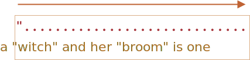
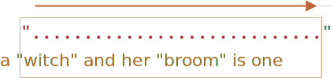
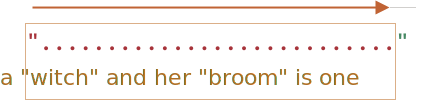
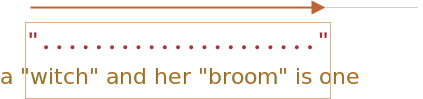
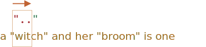
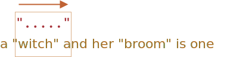

# Greedy and lazy quantifiers

Quantifiers are very simple from the first sight, but in fact they can be tricky.

We should understand how the search works very well if we plan to look for something more complex than `pattern:/\d+/`.

Let's take the following task as an example.

We have a text and need to replace all quotes `"..."` with guillemet marks: `«...»`. They are preferred for typography in many countries.

For instance: `"Hello, world"` should become `«Hello, world»`. There exist other quotes, such as `„Witam, świat!”` (Polish) or `「你好，世界」` (Chinese), but for our task let's choose `«...»`.

The first thing to do is to locate quoted strings, and then we can replace them.

A regular expression like `pattern:/".+"/g` (a quote, then something, then the other quote) may seem like a good fit, but it isn't!

Let's try it:

```js run
let regexp = /".+"/g;

let str = 'a "witch" and her "broom" is one';

alert( str.match(regexp) ); // "witch" and her "broom"
```

...We can see that it works not as intended!

Instead of finding two matches `match:"witch"` and `match:"broom"`, it finds one: `match:"witch" and her "broom"`.

That can be described as "greediness is the cause of all evil".

## Greedy search

To find a match, the regular expression engine uses the following algorithm:

- For every position in the string
    - Try to match the pattern at that position.
    - If there's no match, go to the next position.

These common words do not make it obvious why the regexp fails, so let's elaborate how the search works for the pattern `pattern:".+"`.

1. The first pattern character is a quote `pattern:"`.

    The regular expression engine tries to find it at the zero position of the source string `subject:a "witch" and her "broom" is one`, but there's `subject:a` there, so there's immediately no match.

    Then it advances: goes to the next positions in the source string and tries to find the first character of the pattern there, fails again, and finally finds the quote at the 3rd position:

    

2. The quote is detected, and then the engine tries to find a match for the rest of the pattern. It tries to see if the rest of the subject string conforms to `pattern:.+"`.

    In our case the next pattern character is `pattern:.` (a dot). It denotes "any character except a newline", so the next string letter `match:'w'` fits:

    

3. Then the dot repeats because of the quantifier `pattern:.+`. The regular expression engine adds to the match one character after another.

    ...Until when? All characters match the dot, so it only stops when it reaches the end of the string:

    

4. Now the engine finished repeating `pattern:.+` and tries to find the next character of the pattern. It's the quote `pattern:"`. But there's a problem: the string has finished, there are no more characters!

    The regular expression engine understands that it took too many `pattern:.+` and starts to *backtrack*.

    In other words, it shortens the match for the quantifier by one character:

    

    Now it assumes that `pattern:.+` ends one character before the string end and tries to match the rest of the pattern from that position.

    If there were a quote there, then the search would end, but the last character is `subject:'e'`, so there's no match.

5. ...So the engine decreases the number of repetitions of `pattern:.+` by one more character:

    

    The quote `pattern:'"'` does not match `subject:'n'`.

6. The engine keep backtracking: it decreases the count of repetition for `pattern:'.'` until the rest of the pattern (in our case `pattern:'"'`) matches:

    

7. The match is complete.

8. So the first match is `match:"witch" and her "broom"`. If the regular expression has flag `pattern:g`, then the search will continue from where the first match ends. There are no more quotes in the rest of the string `subject:is one`, so no more results.

That's probably not what we expected, but that's how it works.

**In the greedy mode (by default) a quantifier is repeated as many times as possible.**

The regexp engine adds to the match as many characters as it can for `pattern:.+`, and then shortens that one by one, if the rest of the pattern doesn't match.

For our task we want another thing. That's where a lazy mode can help.

## Lazy mode

The lazy mode of quantifiers is an opposite to the greedy mode. It means: "repeat minimal number of times".

We can enable it by putting a question mark `pattern:'?'` after the quantifier, so that it becomes  `pattern:*?` or `pattern:+?` or even `pattern:??` for `pattern:'?'`.

To make things clear: usually a question mark `pattern:?` is a quantifier by itself (zero or one), but if added *after another quantifier (or even itself)* it gets another meaning -- it switches the matching mode from greedy to lazy.

The regexp `pattern:/".+?"/g` works as intended: it finds `match:"witch"` and `match:"broom"`:

```js run
let regexp = /".+?"/g;

let str = 'a "witch" and her "broom" is one';

alert( str.match(regexp) ); // witch, broom
```

To clearly understand the change, let's trace the search step by step.

1. The first step is the same: it finds the pattern start `pattern:'"'` at the 3rd position:

    

2. The next step is also similar: the engine finds a match for the dot `pattern:'.'`:

    

3. And now the search goes differently. Because we have a lazy mode for `pattern:+?`, the engine doesn't try to match a dot one more time, but stops and tries to match the rest of the pattern  `pattern:'"'` right now:

    

    If there were a quote there, then the search would end, but there's `'i'`, so there's no match.
4. Then the regular expression engine increases the number of repetitions for the dot and tries one more time:

    

    Failure again. Then the number of repetitions is increased again and again...
5. ...Till the match for the rest of the pattern is found:

    

6. The next search starts from the end of the current match and yield one more result:

    

In this example we saw how the lazy mode works for `pattern:+?`. Quantifiers `pattern:*?` and `pattern:??` work the similar way -- the regexp engine increases the number of repetitions only if the rest of the pattern can't match on the given position.

**Laziness is only enabled for the quantifier with `?`.**

Other quantifiers remain greedy.

For instance:

```js run
alert( "123 456".match(/\d+ \d+?/) ); // 123 4
```

1. The pattern `pattern:\d+` tries to match as many digits as it can (greedy mode), so it finds  `match:123` and stops, because the next character is a space `pattern:' '`.
2. Then there's a space in the pattern, it matches.
3. Then there's `pattern:\d+?`. The quantifier is in lazy mode, so it finds one digit `match:4` and tries to check if the rest of the pattern matches from there.

    ...But there's nothing in the pattern after `pattern:\d+?`.

    The lazy mode doesn't repeat anything without a need. The pattern finished, so we're done. We have a match `match:123 4`.

```smart header="Optimizations"
Modern regular expression engines can optimize internal algorithms to work faster. So they may work a bit differently from the described algorithm.

But to understand how regular expressions work and to build regular expressions, we don't need to know about that. They are only used internally to optimize things.

Complex regular expressions are hard to optimize, so the search may work exactly as described as well.
```

## Alternative approach

With regexps, there's often more than one way to do the same thing.

In our case we can find quoted strings without lazy mode using the regexp `pattern:"[^"]+"`:

```js run
let regexp = /"[^"]+"/g;

let str = 'a "witch" and her "broom" is one';

alert( str.match(regexp) ); // witch, broom
```

The regexp `pattern:"[^"]+"` gives correct results, because it looks for a quote `pattern:'"'` followed by one or more non-quotes `pattern:[^"]`, and then the closing quote.

When the regexp engine looks for `pattern:[^"]+` it stops the repetitions when it meets the closing quote, and we're done.

Please note, that this logic does not replace lazy quantifiers!

It is just different. There are times when we need one or another.

**Let's see an example where lazy quantifiers fail and this variant works right.**

For instance, we want to find links of the form `<a href="..." class="doc">`, with any `href`.

Which regular expression to use?

The first idea might be: `pattern:/<a href=".*" class="doc">/g`.

Let's check it:
```js run
let str = '...<a href="link" class="doc">...';
let regexp = /<a href=".*" class="doc">/g;

// Works!
alert( str.match(regexp) ); // <a href="link" class="doc">
```

It worked. But let's see what happens if there are many links in the text?

```js run
let str = '...<a href="link1" class="doc">... <a href="link2" class="doc">...';
let regexp = /<a href=".*" class="doc">/g;

// Whoops! Two links in one match!
alert( str.match(regexp) ); // <a href="link1" class="doc">... <a href="link2" class="doc">
```

Now the result is wrong for the same reason as our "witches" example. The quantifier `pattern:.*` took too many characters.

The match looks like this:

```html
<a href="....................................." class="doc">
<a href="link1" class="doc">... <a href="link2" class="doc">
```

Let's modify the pattern by making the quantifier `pattern:.*?` lazy:

```js run
let str = '...<a href="link1" class="doc">... <a href="link2" class="doc">...';
let regexp = /<a href=".*?" class="doc">/g;

// Works!
alert( str.match(regexp) ); // <a href="link1" class="doc">, <a href="link2" class="doc">
```

Now it seems to work, there are two matches:

```html
<a href="....." class="doc">    <a href="....." class="doc">
<a href="link1" class="doc">... <a href="link2" class="doc">
```

...But let's test it on one more text input:

```js run
let str = '...<a href="link1" class="wrong">... <p style="" class="doc">...';
let regexp = /<a href=".*?" class="doc">/g;

// Wrong match!
alert( str.match(regexp) ); // <a href="link1" class="wrong">... <p style="" class="doc">
```

Now it fails. The match includes not just a link, but also a lot of text after it, including `<p...>`.

Why?

That's what's going on:

1. First the regexp finds a link start `match:<a href="`.
2. Then it looks for `pattern:.*?`: takes one character (lazily!), check if there's a match for `pattern:" class="doc">` (none).
3. Then takes another character into `pattern:.*?`, and so on... until it finally reaches `match:" class="doc">`.

But the problem is: that's already beyond the link `<a...>`, in another tag `<p>`. Not what we want.

Here's the picture of the match aligned with the text:

```html
<a href="..................................." class="doc">
<a href="link1" class="wrong">... <p style="" class="doc">
```

So, we need the pattern to look for `<a href="...something..." class="doc">`, but both greedy and lazy variants have problems.

The correct variant can be: `pattern:href="[^"]*"`. It will take all characters inside the `href` attribute till the nearest quote, just what we need.

A working example:

```js run
let str1 = '...<a href="link1" class="wrong">... <p style="" class="doc">...';
let str2 = '...<a href="link1" class="doc">... <a href="link2" class="doc">...';
let regexp = /<a href="[^"]*" class="doc">/g;

// Works!
alert( str1.match(regexp) ); // null, no matches, that's correct
alert( str2.match(regexp) ); // <a href="link1" class="doc">, <a href="link2" class="doc">
```

## Summary

Quantifiers have two modes of work:

Greedy
: By default the regular expression engine tries to repeat the quantifier as many times as possible. For instance, `pattern:\d+` consumes all possible digits. When it becomes impossible to consume more (no more digits or string end), then it continues to match the rest of the pattern. If there's no match then it decreases the number of repetitions (backtracks) and tries again.

Lazy
: Enabled by the question mark `pattern:?` after the quantifier. The regexp engine tries to match the rest of the pattern before each repetition of the quantifier.

As we've seen, the lazy mode is not a "panacea" from the greedy search. An alternative is a "fine-tuned" greedy search, with exclusions, as in the pattern `pattern:"[^"]+"`.
