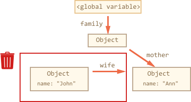
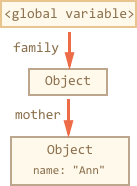
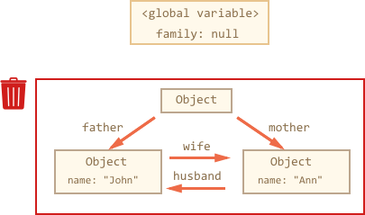

# Memory Management

Memory management in Javascript is performed automatically and invisibly to us. We create primitives, objects, functions... All that takes memory.

What happens with an object when it's not needed any more? Can we occasionally create problems for memory management and get performance problems because of that? To answer that -- let's get under the hood of the Javascript engine.

[cut]

## Reachability

The main concept of memory management in Javascript is *reachability*. 

Simply put, "reachable" values are those that are accessible now or in the future. They are guaranteed to be stored in memory.

1. There's a base set of reachable values. For instance:

    - Local variables and parameters of the current function.
    - Variables and parameters for other functions in the current chain of nested calls.
    - Global variables.

    These variables are called *roots*.

2. **Any other value is retained in memory only while it's reachable from a root by a reference of by a chain of references.**

There's a background process that runs by the engine itself called [Garbage collector](https://en.wikipedia.org/wiki/Garbage_collection_(computer_science)), it monitors all objects and removes those that became unreachable.


Things are very simple for primitive values. They are copied as a whole on assignment. A single primitive can only be stored in one place, there are no references for them. So if there was a string in a variable, and it was replaced with another string, then the old one can safely be junked.

Objects from the other hand can be referenced from multiple variables. If two variables store a reference to the same object, then even if one of them is overwritten, the object is still accessible through the second one. That's why a special "garbage collector" is needed that watches the references.

The basic garbage collection algorithm is called "mark-and-sweep".

Regularly the following "garbage collection" steps are performed:

- The collector follows all references from roots and remembers the objects.
- All objects except those are removed.

Let's see examples to get the better picture.

## A simple example

Here's the simplest example:

```js
// user has a reference to the object
let user = {
  name: "John"
};

// user is overwritten, the reference is lost
user = null;
```

After the variable is overwritten, the object `{name: "John"}` becomes unreachable. There's no way to access it, no references to it. Garbage collector will junk the data and free the memory.

## Two references

Now let's imagine we copied the reference:

```js
// user has a reference to the object
let user = {
  name: "John"
};

*!*
let admin = user;
*/!*

user = null;
```

Here we still can access the object via `admin` global variable, so it's in memory. If we overwrite `admin` too, then it can be removed.


## Mutual links

Now a more complex example. The family:

```js
function marry(man, woman) {
  woman.husband = man;
  man.wife = woman;

  return {
    father: man,
    mother: woman
  }
}

let family = marry({
  name: "John"
}, {
  name: "Ann"
});
```

Function `marry` "marries" two objects by giving them references to each other and returns a new object that contains them both.

The resulting memory structure:


Here arrows depict references. The `"name"` property is not a reference, it stores a primitive, so it's drawn inside the object.

To activate garbage collection, let's remove two references:

```js
delete family.father;
delete family.mother.husband;
```

Note that if the deletion of any one of them would not lead to anything, because all objects are still reachable.

But if we delete the two, then we can see that the object `"John"` has no incoming references any more:



**Outgoing references do not matter. Only incoming ones can make the object reachable.**

The former `family.father` is now unreachable and will be removed from the memory with all its data that also became unaccessible.

After garbage collection:



## Unreachable island

It is possible that the whole island of interlinked objects becomes unreachable and is removed from the memory.

The source object is the same as above. Then:

```js
family = null;
```

The result:



This example demonstrates how important the concept of reachability is.

It is clearly seen that `"John"` and `"Ann"` objects are still linked, both have incoming references. But it's not enough. 

The former `"family"` object has been unlinked from the root, there's no reference to it any more, so the whole island became unreachable and will be removed.

## Generational optimization

The simple garbage collection algorithm has a problem. 

If there are many objects, then it may take time to walk all paths from the roots and find all unreachables. And that process must be atomic: no new links should appear and no existing ones should be modified until it completes. 

Essentially that means that the script execution is paused while the search is in progress. Pauses may be small like few milliseconds for simple scripts or noticeable like `100+ms` for big programs with tons of objects. Such hiccups can be unpleasant and even disruptive for program systems that operate on real-time financial or medical data.

So various optimizations are applied.

One of most widely used in JS engines is so-called "generational" garbage collection.

Objects are split into two sets: "old ones" and "new ones". Each set has its own memory area.

A new object is created in the "new" memory area and, if survived long enough, migrates to the "old" one. The "new" area is usually small and is garbage collected often. The "old" area is big and rarely cleaned up.

In practice, that's very effective, because most objects are created and destroyed almost immediately. For instance when they are local variables of a function.

And few objects survive for a long time, like the object with the current visitor data.

If you are familiar with low-level programming, the more detailed information about V8 garbage collector is in the article [A tour of V8: Garbage Collection](http://jayconrod.com/posts/55/a-tour-of-v8-garbage-collection).

## Замыкания

Объекты переменных, о которых шла речь ранее, в главе про замыкания, также подвержены сборке мусора. Они следуют тем же правилам, что и обычные объекты.

Объект переменных внешней функции существует в памяти до тех пор, пока существует хоть одна внутренняя функция, ссылающаяся на него через свойство `[[Scope]]`.

Например:

- Обычно объект переменных удаляется по завершении работы функции. Даже если в нём есть объявление внутренней функции:

    ```js
    function f() {
      var value = 123;

      function g() {} // g видна только изнутри
    }

    f();
    ```

    В коде выше `value` и `g` являются свойствами объекта переменных. Во время выполнения `f()` её объект переменных находится в текущем стеке выполнения, поэтому жив. По окончанию, он станет недостижимым и будет убран из памяти вместе с остальными локальными переменными.
- ...А вот в этом случае лексическое окружение, включая переменную `value`, будет сохранено:

    ```js
    function f() {
      var value = 123;

      function g() {}

    *!*
      return g;
    */!*
    }

    var g = f(); // функция g будет жить и сохранит ссылку на объект переменных
    ```

    В скрытом свойстве `g.[[Scope]]` находится ссылка на объект переменных, в котором была создана `g`. Поэтому этот объект переменных останется в памяти, а в нём -- и `value`.
- Если `f()` будет вызываться много раз, а полученные функции будут сохраняться, например, складываться в массив, то будут сохраняться и объекты `LexicalEnvironment` с соответствующими значениями  `value`:

    ```js
    function f() {
      var value = Math.random();

      return function() {};
    }

    // 3 функции, каждая ссылается на свой объект переменных,
    // каждый со своим значением value
    var arr = [f(), f(), f()];
    ```
- Объект `LexicalEnvironment` живёт ровно до тех пор, пока на него существуют ссылки. В коде ниже после удаления ссылки на `g` умирает:

    ```js
    function f() {
      var value = 123;

      function g() {}

      return g;
    }

    var g = f(); // функция g жива
    // а значит в памяти остается соответствующий объект переменных f()

    g = null; // ..а вот теперь память будет очищена
    ```

### Оптимизация в V8 и её последствия

Современные JS-движки делают оптимизации замыканий по памяти. Они анализируют использование переменных и в случае, когда переменная из замыкания абсолютно точно не используется, удаляют её.

В коде выше переменная `value` никак не используется. Поэтому она будет удалена из памяти.

**Важный побочный эффект в V8 (Chrome, Opera) состоит в том, что удалённая переменная станет недоступна и при отладке!**

Попробуйте запустить пример ниже с открытой консолью Chrome. Когда он остановится, в консоли наберите `alert(value)`.

```js run
function f() {
  var value = Math.random();

  function g() {
    debugger; // выполните в консоли alert( value ); Нет такой переменной!
  }

  return g;
}

var g = f();
g();
```

Как вы могли увидеть -- нет такой переменной! Недоступна она изнутри `g`. Интерпретатор решил, что она нам не понадобится и удалил.

Это может привести к забавным казусам при отладке, вплоть до того что вместо этой переменной будет другая, внешняя:

```js run
var value = "Сюрприз";

function f() {
  var value = "самое близкое значение";

  function g() {
    debugger; // выполните в консоли alert( value ); Сюрприз!
  }

  return g;
}

var g = f();
g();
```

```warn header="Ещё увидимся"
Об этой особенности важно знать. Если вы отлаживаете под Chrome/Opera, то наверняка рано или поздно с ней встретитесь!

Это не глюк отладчика, а особенность работы V8, которая, возможно, будет когда-нибудь изменена. Вы всегда сможете проверить, не изменилось ли чего, запустив примеры на этой странице.
```

## Влияние управления памятью на скорость

На создание новых объектов и их удаление тратится время. Это важно иметь в виду в случае, когда важна производительность.

В качестве примера рассмотрим рекурсию. При вложенных вызовах каждый раз создаётся новый объект с переменными и помещается в стек. Потом память из-под него нужно очистить. Поэтому рекурсивный код будет всегда медленнее использующего цикл, но насколько?

Пример ниже тестирует сложение чисел до данного через рекурсию по сравнению с обычным циклом:

```js run
function sumTo(n) { // обычный цикл 1+2+...+n
  var result = 0;
  for (var i = 1; i <= n; i++) {
    result += i;
  }
  return result;
}

function sumToRec(n) { // рекурсия sumToRec(n) = n+SumToRec(n-1)
  return n == 1 ? 1 : n + sumToRec(n - 1);
}

var timeLoop = performance.now();
for (var i = 1; i < 1000; i++) sumTo(1000); // цикл
timeLoop = performance.now() - timeLoop;

var timeRecursion = performance.now();
for (var i = 1; i < 1000; i++) sumToRec(1000); // рекурсия
timeRecursion = performance.now() - timeRecursion;

alert( "Разница в " + (timeRecursion / timeLoop) + " раз" );
```

Различие в скорости на таком примере может составлять, в зависимости от интерпретатора, 2-10 раз.

Вообще, этот пример -- не показателен. Ещё раз обращаю ваше внимание на то, что такие искусственные "микротесты" часто врут. Правильно их делать -- отдельная наука, которая выходит за рамки этой главы. Но и на практике ускорение в 2-10 раз оптимизацией по количеству объектов (и вообще, любых значений) -- отнюдь не миф, а вполне достижимо.

В реальной жизни в большинстве ситуаций такая оптимизация несущественна, просто потому что "JavaScript и так достаточно быстр". Но она может быть эффективной для "узких мест" кода.
